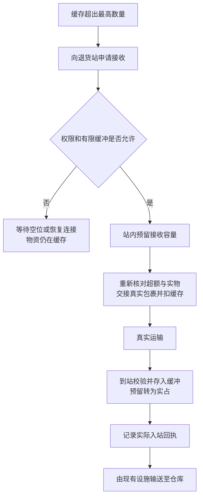

# 物流系统对抗式审查

项目：Create: Feed Me Packages! / 机械动力：喂我发包！  
日期：2026-08-28  
范围：Minecraft 1.21.1 / NeoForge，当前立项设计及三个物流相关项目的源码路径。  
性质：**第一轮设计审查。不是游戏内漏洞复现，也不是实现授权。**

## 后续范围更新：以此为准阅读历史审查

**2026-08-28，用户在首轮审查后收窄了终端职责，并将物资与格子设置改为归玩家。** 以下原始反例、24 类风险、20 项未执行测试及源码证据保留，便于追溯；其中全程运输跟踪、丢失判断、特殊变体存储、终端作为库存归属标识和退货站协议不再整套作为当前需求或版本验收门槛。当前产品定义以[项目计划书](../项目计划书.md)和项目规则为准。

2026-08-29 批注曾要求首版包含改装护甲拆卸；后续最新决定已经替代该范围：首个可玩版本暂时必需 Create／Curios，只做供应链坠，供应链甲、供应链盔及拆卸后置。不同网络终端仍全部冲突停用，须手动禁用某件；JEI 向原版合成界面填料、纸飞机和运输蜂两套补货测试继续属于首个版本。退货确定为基础补货之后的下一阶段，不新增退货站或全程回执系统。

个人缓存、死亡保留、同物单格及“第三方侵入式接入时先保原版”等边界继续有效。五阶段已确定为 9／128、16／256、24／512、30／1,024、36／2,048；新玩家背包优先、按格重置、非空先取空、原版鼠标习惯与滑条拖动／滚轮／数字精调也已确认。正式升级道具采用序列组装、中间产物与概率产出，但首个版本可简化；第三方背包访问插件不纳入初期版本。本文原始源码核实日期仍为 2026-08-28；后续静态证据均未新增游戏联调结论。

同日后续新增方向：运输蜂退货保留运输格内原蜂，派出一次性蜂，交付或失去可用目标终止后销毁，不产出普通蜂；失败原包当地掉落，不退缓存、不复制、不赔付。用户最新明确先不管蜂串网，相信玩家建设，沿用原生选站与回退，在实际游玩后再决定是否适配。因此 R13 的防串网方案及其历史 P0 分级不再构成当前实现门槛，T15 中相关场景保留为观察项；源码事实不变，没有新增游戏验证结论。

| 主题 | 后续用户决定 | 对本文原建议的影响 |
| --- | --- | --- |
| 缓存归属 | 物资与格子设置跟玩家走，饰品不持有个人缓存；更换饰品仍访问自己的记录，转交不转交个人数据，本件网络配置见下一行 | 原先按具体终端保存或给饰品绑定原主的方向被替代；R09、R12、R23、T14 等按个人缓存重新定范围，不能将首次换饰品视为新库存 |
| 本件网络绑定 | 每件最多一个网络，可清除；不同网的已佩戴终端同时启用时全部冲突停用，须手动禁用某件 | 网络配置归物品，个人数据归玩家；不采用活动终端选择。同网多件不叠加、不重复发单，冲突时保留禁用入口 |
| 佩戴开关 | 未佩戴时，对玩家来说整套系统不存在：界面、缓存操作与自动物流停用，个人数据保留 | 不能仅隐藏界面而继续取料、发单或拆包；旧操作须受有效佩戴校验。外部已有包裹不干预，重装先收本地专用包裹再检查补货，卸下不清待收记录；R23、T14 按此补充验证；死亡保留规则见下一行 |
| 死亡独立性 | 死亡和摘下饰品均不改变缓存物资与格子；缓存不参与死亡掉落，不受世界死亡不掉落设置影响 | R23、T14 的死亡处理已定，须验证佩戴状态及世界设置均不改变缓存保留，重生不复制物资或重置待收。此前随世界死亡掉落规则的建议未采纳，缓存外物品及包裹不在此保护范围 |
| 升级归属 | 格数与容量升级归玩家；五阶段为石头、铁、安山、黄铜、坚固板，每阶段两项增长 | 换饰品不降级、转交不转移升级、多件不叠加；格数与容量采用最新确认值。plan-v1.0 已固定 `v0.1.0` 简化配方，正式序列组装排到 `v1.0.0` |
| 同物单格 | 同种物品只设一个格，不允许重复 | R19 的重复格问题已有产品边界；在过滤设置、默认模板与恢复入口验证唯一性，不能默默删除重复格内的真实物资 |
| 自动取料 | 原版合成、弓／弩箭矢为首版范围，包含配方书或 JEI 向原版合成界面填料；TaCZ 保留条件目标，侵入式修改时先保原版 | 区分 JEI 过滤拖入与配方填料；补充查询／实际消费分离、弩不二次扣款和 TaCZ 弹种身份验证，不宣称已联调 |
| 丢包与重试 | 不判断丢失，只提供类似工厂仪表的手动重置在途；不按超时自动赔付或重发 | R04 的复制反例仍成立，但不需要实现丢失调查、全局作废或保险协议；重置只清等待记录，不改真实物资 |
| 特殊数据物品 | 特殊实物不入缓存；经提醒后只设置同一物品的默认模板，原物及内容不变 | 取消跨物品映射；默认组件不等于空组件。附魔书与书不同 ID，旧例不作为现行转换规则；R01 的特殊变体存储建议仍未采纳 |
| 缺货与物流反馈 | 下箭头表示待收／需求；上箭头随当前退货研究定义真实发运状态 | 不从本地记录推断运输仍正常；随身发运不能误称载具正来取货或基地已签收，未实现流程不伪装启用 |
| 退货站与运输 | 不自建全局配送；恢复研究运输物格与返回地址，不能出发就不打包；两运输模组都测 | R03、第 3 节的新站、预留和全程回执协议仍未获准。当前研究复用已有载具，出发条件不等于运输途中或最终收货保证 |
| 蜂串网范围 | 先信任玩家建设，不预设防串网适配；实际游玩后再判断 | R13 的固定目标与限制跨网回退转为历史建议，当前不实施；只观察原生行为及影响，不保证必回原站，不取消有效佩戴、饰品绑定、提供者资格或物资守恒检查 |
| 收货边界 | 有效佩戴时，专用地址 `本模组指定的包裹地址@玩家名` 的完整包裹进入玩家物品栏／背包后，本地解包到缓存 | 不追踪运输去向，不拦截所有普通包裹；手动重置后的旧包仍可按地址处理，不要求仍有未完成订单 |
| 部分入库 | 只收实际容量能容纳的部分，剩余留原包；腾位优先续收，残包手拆／移走后不能留下假等待 | 只按真实转入量增加缓存，不计普通散装物品；到货记账与残包存在状态分开，不能重复结算或阻塞补货 |
| 大量分包 | 沿用 Create 打包机的连续标准分包，每包最多 9 个槽，各槽遵守物品原生堆叠上限 | R07 保留为数量守恒验证，不再用大批量需求推导自建运输系统或超容量包裹 |
| 首个版本与命名 | 必需 Create／Curios，只做供应链坠；退货下一阶段，TaCZ、供应链甲／盔及正式序列组装后置 | 旧 Curios 可选与首版拆卸范围被替代；供应链三名称已确认，不再作为候选 |
| 五阶段与交互 | 9／16／24／30／36 格；单格 128／256／512／1,024／2,048；背包优先、按格重置、非空先取空、原版鼠标及三种精调 | 旧数值与交互建议状态被替代；后续只做实现与实玩平衡验证 |

本地转移仍须保证实际接收多少才处理多少、不重复入库、不吞掉剩余内容。这不要求终端掌握每件世界物资的去向。命名、五阶段数值和主要交互已经确认；具体配方材料属于后续版本平衡。下文原始风险与测试保留历史措辞，须结合文首最新范围阅读；**没有开始实现或游戏测试。**

## 0. 首轮审查结论（范围收窄前，保留历史）

现有的缓存数量规则可以保留。最需要补齐的不是更多数量阈值，而是三件事：**哪些物品能合并、每批实物当前由谁持有、什么证据才能证明完成或失败。**

用户提出的退货站值得继续细化，但它只能提供有限的接收能力，不能保证运输不出事故，也不能把满仓变成无限仓库。推荐方向是：退货站拥有自己的有限接收缓冲，受理时预留空间，实际收货后回执，缓冲与预留用尽时停止继续受理。

第一轮识别了 24 类风险。以下防线均为**审查建议，未获用户确认**；不修改已经确认的补退货口径，不把退货站或运输保险直接加入已确认功能。

最优先待决策：**是否接受真实运输事故可能损失物资，而重新下单必须再次消耗网络库存，不凭超时直接补偿实物。** 本审查推荐接受这一边界。否则需要对包裹的所有打开、掉落、转交和回收路径建立可控的保险协议，兼容成本会显著增加。

## 1. 审查依据和不能改变的规则

### 1.1 首轮审查时的已确认规则

本节保留当时的输入，后续特殊物品限制、本地地址收包和手动重置等补充见文首及当前计划书；不能据以下旧表述扩大当前范围。

- 缓存独立于普通背包；取出立即扣缓存，存回立即加缓存。
- 低于启用的最低数量就补回最低数量；超过启用的最高数量就退回最高数量；等号边界不新增订单。
- 在途不算缓存现货，只用于防重复；到货不预留缓存空间，装不下的实物固定留在原包裹，首次观察与残包存在状态分开。
- 新格为空；背包拖入是真实存货，JEI 拖入仅设置过滤；最低／最高端点初始分别关闭。
- 普通使用先取出真实物品，合成可以自动调用缓存现货。
- 首轮曾按具体终端保留数据，卸下、掉落和重装不重置；**后续已改为物资与格子设置归玩家，饰品只提供访问能力，见文首更新。**
- 先补货，后退货；运输必须使用真实包裹。

产品入口：[项目计划书](../项目计划书.md)。

### 1.2 证据范围

| 对象 | 本轮核对范围 | 能证明什么 |
| --- | --- | --- |
| NeoForge | 官方 1.21.1 文档及 `IItemHandler` 源码 | 数据组件、配方匹配与容器接口的语义 |
| Create | `mc1.21.1/dev`，本轮固定提交 `0924e93639ad5f61cfc39a221d909e16f2893df1` | 库存匹配、请求返回值、普通包裹容量与拆包路径 |
| Create: Mobile Packages | 本地提交 `46679bea2a0510f4fa939478ee917fc67e81e0a8`，工作树干净 | 蜂取货、交付、目标回退、玩家截取路径 |
| Create More: Package Couriers | 本地提交 `a5744d2a1bfbc505a59faba108385707d7abd472`，工作树干净 | 飞行结束、目的地满、整包／拆包交付与目标反序列化 |

源码事实和设计推断分别标注。未编译本项目，未启动游戏，未检查所有外部模组的覆盖逻辑，也没有验证崩溃时不同存档文件的落盘顺序。这些提交是研究快照，不是已批准依赖组合。

## 2. 用户提出的四个问题

### R01：带 NBT 的物品怎么处理？

> 后续状态：特殊物品不直接作为缓存实物存入。下方“精确变体存储、以后扩大稳定数据兼容”是旧建议，已被收窄；源码关于组件和默认组件的事实仍可参考。用户提出的普通版本过滤映射须另行细化，不能实现成静默剥除实物数据。

**反例。** 两把不同耐久的镐、两本不同附魔的书、同一种但装着不同内容的容器，物品 ID 可以相同。若缓存只存一个 ID 和一个数量，就会把它们合成同一种物品，取出时改变属性甚至复制容器内容。

**已核实事实。** 1.21.1 的 `ItemStack` 包含物品、数量和数据组件；不能只按旧式根 NBT 理解所有物品数据。组件有自己的相等、持久化和网络编码语义。Create 本次读取的 `InventorySummary` 也用 `isSameItemSameComponents` 合并和查询库存。[物品文档][N1]、[组件文档][N2]、[Create 库存匹配][C2]

**建议防线。**

1. 一格先只代表一种精确物品变体：物品 ID 与完整组件相同才允许合并，数量单独保存。不同附魔、耐久、名称、内容不得靠忽略字段硬合并。
2. 区分三种匹配：请求过滤用于找货，存储身份用于保真，配方匹配用于判断能否作为原料。它们不能共用一个宽松的按 ID 判断。
3. JEI 拖入只能记录 JEI 实际提供的样本。若样本没有玩家那件物品的特殊数据，不应猜出那些数据；需要精确变体时可从真实物品设置过滤。UI 显示关键差异，避免同图标却一直缺货。
4. 普通材料、具有稳定数据的物品、逐件状态物品分别验证。不能以有没有组件为开关，因为普通物品也有默认组件。
5. 有独立身份、嵌套库存或动态行为的物品不能直接承诺千级计数压缩；即使组件比较相等，也可能需要额外的逐件身份验证。参见 R05、R06。

**保守的首版建议。** 先支持已验证的普通材料和建筑物品；稳定数据变体逐项扩大兼容。工具、背包、包裹和本模组终端暂不默认进入高容量压缩。限制必须在存入和配置时明确告知，不能到收货时才无提示吞掉。

**待定。** 是否采用上述首版兼容边界、是否提供宽松过滤，以及特殊物品能否进入自动合成。它们不因本次审查自动定稿。

### R02：网络里根本没有要补的物品？

> 后续状态：缺货反馈采用灰色下箭头，已有待收记录显示绿色下箭头。请求返回值的源码限制仍有效，但当前不要求为此建设全程出库／运输回执；plan-v1.0 固定把成功提交的请求量记为可手动重置的本地承诺，并在真实专用包第一次观察时按匹配内容结算一次，不按等待时间自动认定丢失。

**反例。** 缓存缺 128，查询显示 0。系统每 tick 发一单，或把请求函数的成功返回记成在途 128，造成刷单或永远等不到的虚假订单。

**已核实事实。** 本次 Create `broadcastPackageRequest` 对非空订单分配请求后执行发送流程并返回 `true`，不提供逐项实际出库收据；分配结果为空时也存在返回 `true` 的代码路径。它不能作为足量发货证明。库存汇总也有缓存且依赖可见物流链接。[请求源码][C1]

**建议防线。**

- 没有匹配可用库存：保留过滤与缺口，显示等待库存，不增加缓存、不登记虚假在途、不每 tick 创建新订单。
- 只有部分库存：允许按实际可受理量处理，剩余继续等待；例如缺 128、可用 40，不把整笔 128 标为已发出。查询到 40 也不是锁住了 40，最终仍需核对受理、实际出库和包裹。
- 库存变化或间隔检查时重算缺口；间隔、合并窗口和重试上限是调度参数，不新增玩家数量阈值。
- 区分缺货、网络不可见、未绑定、无权限、打包机忙和运输端不可用。证据不足时显示当前无法确认可用库存，不武断声称整个网络绝对没有物品。
- 多个玩家抢最后一批材料时，以实际处理结果为准；不能把同一份库存承诺给所有终端。
- 不默认触发网络自动生产或递归合成；这是另一项产品能力。玩家现有工厂后续补进库存即可恢复物流。

### R03：退货时网络没有空间？

> 后续状态：退货方案暂停讨论，不自建全局配送。以下退货站容量预留方案没有被采纳为当前架构；收得下多少才能转移多少的局部守恒原则仍保留。

**反例。** 两名玩家都检查出箱子还有 64 个空位，然后各退 64。第一包占满，第二包到达时已无处可放。只查询一次空间不能解决竞争。

**已核实事实。** NeoForge `insertItem(..., simulate=true)` 只模拟插入；执行插入会返回未接收的剩余物资。它不是库容预留协议。飞机的方块目标检查也是查询空间与后来交付分开的流程。[容器接口][N4]、[飞机交付][P1]

**对退货站的判断。** 有价值，但应明确它承诺的是把货接入自己的有限缓冲，而不是宣称网络某处将来一定有位置。建议协议见第 3 节。

- 站内有缓冲、下游仓库满：可以暂存已经受理的退货，显示已入站／等待出库。
- 站内缓冲加已预留空间用完：停止受理新退货，尚未发出的货继续留在玩家缓存，超过最高数量可以持续存在，不代表必须立即消灭超额。
- 站不存在、未加载、无权使用或运输不可用：等待并说明原因，不凭这些状态扣缓存。
- 不把所有已请求但未接收的货塞进无上限的服务器队列；那会变相形成无限仓库。

### R04：请求包裹出意外，没能抵达？

> 后续状态：已确定不判断丢失、不自动赔付或按超时重发，只让玩家手动重置在途记账。旧包不被撤销或销毁，迟到仍按地址收包。下方调查、证明灭失和保险政策选项不再是本轮待决策事项。

**反例。** 系统等了很久，把包裹判为丢失并补偿 64。原包其实被别人捡走，仍可拆出 64。仅在终端保存已接收订单号，拦不住别处拆包。

**已核实事实。** 蜂载荷可经玩家交互被取走，Create 普通包裹另有直接交付内容的打开入口；这些路径不认识本模组尚未实现的订单账本。飞机结束飞行也可能生成世界包裹，而不是成功入库。[蜂截取][B2]、[Create 拆包][C3]、[飞机交付][P1]

必须区分两种后果：

| 操作 | 旧包后来仍被使用 | 后果 |
| --- | --- | --- |
| 再从基地真实扣货发一单 | 两批货都存在，但基地也付出了两批货 | 重复采购、超额配送；不一定是凭空复制 |
| 直接补偿缓存，或把已经派出的退货重新加回缓存 | 旧包仍包含原物资 | 凭空复制物资 |

**建议按证据处理。**

| 证据状态 | 建议行为 |
| --- | --- |
| 尚未完成实物交接，发运失败 | 取消准备操作；原物资仍由原持有者保管，不产生第二份 |
| 已交接给运输方，但暂未收到 | 标为在途或疑似失联；不能凭超时把物资加回来 |
| 包裹已退回且真实重新接收 | 按实际收回量入库，结清相应记录 |
| 适配器能证明实际灭失或最终失败 | 按已确认的事故政策处理；重新补货仍从网络实际库存取得 |
| 只有超时，无法证明灭失 | 推荐暂停这笔订单的自动重试；保留记录，允许有明确提示的人工处理 |
| 旧包迟到、订单已人工重下 | 仍核对实物、身份和容量；不能静默丢弃，也不能再次自动补偿 |

超时可以触发调查、提示和重试决策，但不能直接证明物资不存在。已装运的容量预留也不能仅因计时器到期就无条件释放；否则迟到包又会撞上满仓。

**需要玩家决定。** 是保留真实运输的事故损失，还是提供保险体验？本审查推荐前者，并限制未知状态下的自动重发。若要保险，必须证明旧货已经回收或所有相关旧货路径都被可靠作废；仅添加订单编号、超时或收据表不够。

## 3. 退货站候选：能承诺什么？（暂缓，历史建议）

用户已否决自建全局配送，并要求退货以后再讨论。本节保留首轮提出的候选协议，**不是已批准新方块、运输调度或实施任务**；今后若只利用现有运输，也不必照搬这套协议。

### 3.1 推荐职责

退货站是一个拥有地址、身份、权限和有限接收缓冲的目的地。它接收退货申请并管理预留；仓库分拣和后续输送继续由 Create 设施完成。是否另做停机设施、附着既有容器或借助现有蜂站，仍是实现候选。

容量应按真实物品组件、合法堆叠和实际格位计算，不能只统计空格数；一格还能塞多少同类物品，与能否放进另一种物品是两回事。

图中只表示正常流程；未知交接、部分到货、迟到、站被拆和崩溃不能沿正常路径直接标记成功。

### 3.2 必须防住的反例

1. **重复预留。** 两笔申请不能同时占用同一空间。站自己的接收缓冲必须控制其他插入入口，普通漏斗或其他模组不能随便填掉已承诺空间。只预留外部通用箱子中一个数字不可靠。
2. **申请后库存变化。** 等待载具时，玩家可能取走原本要退的物资。真正装包前应重新算超额，减少或取消未交接申请，避免退掉最后的保留量。准备中的锁定量与缓存现货必须分清。
3. **错误扣款时间。** 真正把实物转交包裹时扣缓存，不能等站签收后才扣，否则在途物资还可在缓存中使用。交接结果未知时也不能立刻回滚生成一份。
4. **错误完成信号。** 实际进入站缓冲后才算入站；取货完成、载具消失或上游请求完成都不是签收。Mobile Packages 的一条路径在取走退货后就把请求设为 `DONE`，还没完成回程。[取货流程][B3]、[请求状态][B4]
5. **缓冲占用。** 入站时只是将预留转为实际占用，不会凭签收多出空位。下游取走物资之后才真正释放接收能力。
6. **站被拆／重建。** 同坐标的新站不能自动继承旧站的入库授权。旧站身份、未到货记录、已有库存如何保留或回收，都需明确；本轮不承诺站被彻底销毁仍无损。
7. **预留超时。** 未装运的申请可以在安全取消后释放；已装运或状态未知的申请，需要迟到处理方案，不能简单套同一个过期清理。
8. **错误回退，当前仅作游玩观察。** 现有蜂的回退路径会尝试其他站；当本网络站列表为空时，候选甚至会扩大到其他网络，不能保证必回指定退货站。[目标回退][B4]、[站选择][B5] 原审查据此建议限制目的地；用户后续选择先沿用原生行为，在实际游玩后再判断是否值得适配，不再预设防串网要求。

### 3.3 退货站不能独自解决

- 运输途中被截取、丢失、转交和外部拆包。
- 把未知运输状态判定为确定失败。
- 无限的后端仓库拥堵或无限的同时退货量。
- 跨模组、跨存档文件的崩溃一致性。
- 另一种运输模组不提供接收拦截或可靠交接入口。

因此，增加退货站不等于已经拥有可靠物流；还需要按运输提供者验证准入、交接和收货协议。它仍然属于补货之后的候选扩展。

## 4. 其他风险登记

**历史范围说明：** 下表 P0／P1／P2 是首轮假设下的级别，不代表当前版本必须实现全部建议防线。特殊变体存储、全程运输证明和退货站相关项须按文首范围重审；本地出入库、合成、权限和持久化的守恒要求仍需验证。

级别含义：**P0** 为真实物资验证前必须设计防线的复制、吞物或越权风险；**P1** 为可玩版本前需解决的可靠性与操作风险；**P2** 为需要明确反馈的体验风险。这里描述的是反例，不宣称现有项目已发生对应游戏故障。

R01—R04 的核心守恒防线均按 P0 对待。其他风险如下：

| 编号 | 级别 | 攻击场景／后果 | 建议防线 |
| --- | --- | --- | --- |
| R05 | P0 | 把有 UUID、库存、能量或逐件状态的物品压成一个样本乘数量，取出后共享身份或复制内容 | 验证可压缩性；逐件物品保留各自状态，未知兼容不默认支持；仅组件相等不是万能证明 |
| R06 | P0 | 把终端放进自己的缓存，或终端 A、B 互相套娃，导致不可取回或身份循环 | 建议首版禁止终端进入终端缓存；其他容器也检查嵌套与序列化负担 |
| R07 | P0 | 几千件退货直接传给一个普通包裹构造器，超容量部分无明确去向 | 按物品实际堆叠上限拆包，并验证每件都进入某个包裹；不能忽略插入剩余。Create 普通包裹构造使用 9 格，列表构造不替调用者无限拆包 [C3] |
| R08 | P0 | 一单分成多包，只记订单已完成；或先入缓存一部分，再执行原来的整包投递 | 记录实际分包／批次接收量和剩余持有者；适配器只能有一个成功交付路径；重复回调不二次入库 |
| R09 | P0 | 发货后玩家换过滤、降低容量、手动存满；到货仍按旧格号写入 | 订单绑定终端、物品变体和配置版本；容量冲突安全拒收或进入有界暂存。选择预留入库空间时，UI 必须显示不可被手动占用的预留量，仍不把在途算成现货 |
| R10 | P0 | 退货排队期间玩家取出原料，旧退货量仍照发；同一批货被两次锁定 | 发运前重算实际超额；同一实物只能有一个交接操作，锁定不能重复使用 |
| R11 | P0 | 已扣缓存未保存包裹、已入站未记录回执，随后保存／崩溃／恢复 | 设计持久交接与对账；在每个切点做受控故障验证。服务端串行执行、加一张账本或单个 SavedData 并不自动保证跨模组原子性 |
| R12 | P0 | 伪造玩家名、终端 ID 或请求包；别人换穿终端后收进错误库存 | 首轮的持有即访问／饰品锁定取舍已被替代：当前按实际玩家身份选择个人缓存，饰品仅提供访问；地址不能授予他人库存或网络权限，仍需服务端验证 |
| R13 | P0（历史） | 原退货站消失，上游将包裹交到其他网络；终端却显示已返回本网络 | 历史建议是限制回退目标；用户最新决定当前不做专门防串网，实际游玩观察后再判断。仍不得虚报已返回原网络，不以消除此项原生风险为当前门槛 [B4]、[B5] |
| R14 | P0 | 站被拆后在原坐标重建，或预留到期后把空间再次许给别人，旧包抵达 | 站身份不只用坐标；预留与运输状态关联，迟到包有有界处置方案；销毁物资的事故政策另定 |
| R15 | P1 | 载具渲染实体消失就判丢件，或者重载后仍假定在追踪原玩家 | 分开渲染实体与运输记录；按提供者核查离线、跨维度和保存恢复。飞机目标反序列化不保留玩家实体，不能只凭旧地址承诺重连 [P2] |
| R16 | P1 | 自动合成把命名材料、贵重变体或带内容的物品当普通材料用掉 | 按真实配方匹配，同时设自动取料保护范围；不要用精确存储规则代替配方规则，也不要只用普通 Ingredient 构造代替组件校验 [N3] |
| R17 | P0 | 批量合成时两处库存同时供料，余物没位置或界面中途关闭，造成双扣或复制 | 提交结果、扣料和余物转移一起验证；预演不扣物资，真正提交只扣一次；已确认合成功能不能被直接删去规避风险 |
| R18 | P1 | 一直缺货，或每取 1 件就立刻发一个包，多人同时反复改滑条 | 合并短时间内的缺口、限制每终端／网络同时订单数，设置退避和公平调度；仍补回最低，不暗中增设补货目标 |
| R19 | P1 | 多格配置同一过滤却有互相冲突的上下限，或允许最低高于最高，补退来回循环 | 建议禁止同一精确变体重复配置并校验最低不高于最高；宽松过滤若以后加入，另审查重叠 |
| R20 | P0 | 高计数被当成普通 ItemStack 转出，Shift、双击、拖拽或旧界面请求重复转移 | 服务端逐次校验合法数量、目标容量和当前菜单／终端；客户端不提交权威库存；遵守接口返回的剩余物资 [N4] |
| R21 | P1 | 组件编码失败、模组被移除、版本改变时，将无法读取的库存当空覆盖 | 保留可诊断原数据，停止该槽修改并说明兼容问题；升级／迁移另行规划，不能用默认空物品掩盖失败 |
| R22 | P1 | 超大书本／容器数据、负数量、整数溢出、无限量标记、频繁同步拖垮服务器 | 限制数值与载荷大小，验证序列化，按变更同步；拒绝异常输入时保留原物资，不靠截断组件解决 |
| R23 | P1 | 死亡、卸下、掉落、换穿、复制同 ID、销毁或转移世界后，库存归属不清 | 首轮按具体终端保存的建议已被替代；当前按玩家保留库存与格子设置，换饰品不克隆或转交数据。死亡保留也已确认，不受佩戴状态和世界死亡掉落设置影响；须验证重生不清空或复制缓存，跨世界／跨存档转移仍未定 |
| R24 | P2 | UI 一律显示缺货／完成，无法区分权限、源区块不可见、等待空位、已取走和已入站 | 给出可操作状态与最后进展；状态未知就明确未知，避免假成功；不为改善显示而偷偷强加载全图 |

### 一个必要的容量取舍

> 后续决定：用户选择部分入库，未收内容留在玩家本地的原包裹中。无需为了这个问题要求运输返航或另设隐藏库存；下文保留首轮比较，不再把保留方式列为待选。

请求中的物资虽然不算缓存现货，但要考虑到货时放在哪里。首轮推荐比较两条候选：预留目标空间，或在无法接收时保留实物并拒收／暂存。前者会限制玩家把预留空间手动填满；后者需要明确由谁保留未收物资。**不能既允许随时填满全部空间，又承诺任何迟到包必定直接入缓存，还不提供其他持有者。** 当前已选择由原包裹保留余货，具体见上述后续决定。

## 5. 状态、实物和验证方法

本节是首轮的检查方法与候选测试，尚未执行。跨全流程核对物资是审查手段，不等于要求终端在运行时追踪整个世界；当前实现范围只登记本地待收、手动重置和实物收包。退货站及特殊物品存储用例必须先按新边界重定，不能直接作为当前发布门槛。

### 5.1 守恒检查

对一笔纯转移，应核对源容器、缓存、发运暂存、在途实物、退货站缓冲和外部实际持有者。订单记录、预计数量、容量预留和完成通知都不是额外实物，不能加入物资总量。

这条守恒检查不把合成前后的不同物品数强行相等；合成须按具体配方的输入、输出和余物校验。真实世界的销毁／消耗也与本模组凭空吞物区分，是否赔付属于事故政策。

状态至少要分清：需求尚未受理、已受理未交接、已交接运输中、部分到货、实际接收完成，以及无法确定的异常。查询库存、建立预留、取货、到达、入站和入仓不能用一个成功标记代替。

### 5.2 待执行的反例验收

以下均为待执行测试，没有已通过项。数值只作为测试输入，不是升级档位或默认设置。

| 测试 | 操作 | 必须观察到的结果 | 覆盖风险 |
| --- | --- | --- | --- |
| T01 | 同 ID、不同附魔／耐久／名称／容器内容依次存入取出 | 不误合并、不改属性；不支持的类型明确拒绝且来源保留 | R01、R05 |
| T02 | JEI 模板拖入；再用普通材料、命名变体分别配置 | JEI 不生成库存；匹配规则可解释，特殊数据不凭空出现 | R01、R16 |
| T03 | 网络 0 库存、40 库存供 128 缺口、两玩家争抢 40 | 无虚假在途，无空单风暴，记录实际受理与实发量，缺口可恢复 | R02、R18 |
| T04 | 断开网络、卸载发货端、打包机忙、移除权限后再恢复 | 原库存不变，状态准确；恢复后重新计算，不清空配置 | R02、R12、R24 |
| T05 | 两名玩家争抢退货站最后一份空间；普通漏斗尝试占用预留 | 不重复承诺空间，不吞第二笔货；未交接物资仍可追踪 | R03、R14 |
| T06 | 站已接单后填满下游仓库，随后逐渐腾空 | 已接收货留在有限缓冲，暂停新单，腾空后继续；无无限隐藏队列 | R03、R24 |
| T07 | 旧包长时间未到；分别测试重新扣库下单和禁止直接补偿 | 正常重下单消耗新库存；未知状态不增加缓存或回滚已发退货 | R04 |
| T08 | 其他玩家截取旧蜂包裹，在终端以外拆开，再让新包到达 | 不因本终端去重误判全世界已去重；总实物与真实扣库相符 | R04、R12 |
| T09 | 退货数千件，混入上限为 1、16、64 的已支持物品 | 每个包裹内容合法，全部余量有去向，不因单包构造截断 | R07、R20 |
| T10 | 单订单多包，重复调用一个到货入口，一包仅能接收一部分 | 每个实际接收量只记一次；后续分包仍可接收，原交付不二次运行 | R08 |
| T11 | 在途时切换过滤、降低容量、手动填满缓存、改上下限 | 不写错槽、不超容量、不吞迟到包；预留或拒收规则与 UI 一致 | R09、R19 |
| T12 | 申请退 88 后先从缓存取出 100，再让载具出发 | 重算剩余超额或安全取消；不照旧退掉应保留的物资 | R10 |
| T13 | 分别在扣料、包裹交接、目的地入库、收据更新附近正常保存及受控中断 | 恢复后能对账；不把未知状态自动变成补偿；不能只验证正常关闭 | R11 |
| T14 | 卸下、掉落重装、死亡、转交、同 ID 复制和跨世界导入 | 已确认的库存保留成立；未授权访问被拒，其他情况符合已定政策 | R12、R23 |
| T15 | 退货途中拆／重建／卸载目的站，旁边设置另一网络蜂站 | 不误称已入原站；按明确回退策略保留或处理实物 | R13、R14 |
| T16 | 飞行中玩家下线、换维度，正常停服重载后上线 | 对每个运输模组分别验证寻址和载荷状态，不依赖渲染实体存在 | R15、R23 |
| T17 | 命名／特殊物品参与自动配方，批量合成带桶的配方，结果没位置时关闭界面 | 不误用保护物品，不重复扣料；结果和余物都守恒 | R16、R17 |
| T18 | 快速改滑条、每次取 1、多玩家多槽长时间缺货 | 有界队列、可接受服务器负担；调度合并不改变已确认数量规则 | R18、R24 |
| T19 | 终端套自身、A/B 互套、巨大组件、负数和溢出请求、旧菜单重放 | 无递归存储、越界或复制；拒绝时不损坏原库存 | R06、R20、R22 |
| T20 | 隔离存档中模拟组件解码失败、兼容提供者缺失和容量升级变化 | 不默认清空原数据，清楚暴露阻塞原因；恢复路径可验证 | R21、R23 |

**原有测试顺序建议，现需重定范围：** 最早原型先覆盖 T01、T03、T07—T11、T13、T17；若未来采用退货站，再评估 T05、T06、T12、T15。T01 要按特殊物品拒收／普通版本过滤改写，T07 要按手动重置改写，本地收包与迟到处理也须按新的地址边界验收。测试替身不能代替真实包裹和实际运输兼容验证。所有破坏性测试只能在隔离实例和可丢弃测试存档中规划执行，当前没有执行这些测试。

## 6. 首轮建议的决策顺序（已被后续反馈替代）

以下顺序仅保留历史依据。事故处理、特殊物品限制、状态箭头和本地收包已有后续方向；退货与其他问题按用户要求以后再讨论，不再按此列表继续追问。

1. **事故与补偿原则。** 推荐物资真实损失不自动赔付；未知状态不直接返还，重新采购仍要真实扣库。这影响账本、重试和迟到处理，优先于选择载具。
2. **物品兼容范围。** 推荐精确组件匹配，先普通材料和建筑物品；逐件状态、嵌套容器与自动合成保护另定。
3. **容量与退货站。** 决定是否新增退货站及其有限缓冲、预留、回执；同时明确玩家缓存的在途空间冲突处理。
4. **权限与生命周期。** 明确终端转交、离线、销毁、恢复、站拆除及取消操作。
5. **调度和具体交互。** 再定等待反馈、批量／冷却、滑条精调与合成范围。

上述旧建议未被整体接受，当前不自动进入实现阶段；后续讨论入口已改为计划书第 7 节的暂存事项。

## 7. 一手来源

| 标识 | 来源与定位 | 本轮用途 |
| --- | --- | --- |
| N1 | [NeoForge 1.21.1 Items][N1] | 物品、ItemStack、组件与可变性 |
| N2 | [NeoForge 1.21.1 Data Components][N2] | 相等性、持久化与同步、不可变约束 |
| N3 | [NeoForge 1.21.1 Ingredients][N3] | 普通 Ingredient 可能忽略组件；精确／部分组件匹配区别 |
| N4 | [NeoForge IItemHandler][N4]，`insertItem`、`extractItem` 文档 | 模拟不等于预留；实际剩余和合法堆叠 |
| C1 | [Create LogisticsManager][C1]，80—95 行及从 98、201 行开始的方法 | 请求成功不等于足量交付；研究提交已固定 |
| C2 | [Create InventorySummary][C2]，78—99、118—125 行 | 按物品与组件合并／查询 |
| C3 | [Create PackageItem][C3]，92—100、217—221、289—315、337—339、371—373 行 | 普通包裹容量、内容和外部打开入口 |
| B1 | [Mobile Packages 玩家投递][B1]，231—241 行 | 整包进入原版背包的默认路径 |
| B2 | [Mobile Packages RoboEntity][B2]，122—147 行 | 玩家可取走载荷；网络成员检查不等于收件人检查 |
| B3 | [Mobile Packages RoboBeeBehaviorController][B3]，60—105 行 | 退货取走后清请求，再继续运输 |
| B4 | [Mobile Packages VirtualRobo][B4]，124—152、177—194、366—371 行 | 目标回退、显示实体与实物记录、DONE 的含义 |
| B5 | [Mobile Packages CMPHelper][B5]，59—76 行 | 本网络站列表为空时扩大候选范围 |
| P1 | [Package Couriers CardboardPlane][P1]，38—60、94—129 行 | 结束飞行不等于入库；整包／逐项交付 |
| P2 | [Package Couriers CourierTarget][P2]，40—46、71—91 行 | 目标序列化不保留玩家实体，重载目标类型变化 |
| P3 | [Package Couriers CardboardPlaneManager][P3]，34—44、102—119 行 | 移除飞行记录和起飞时的空间检查 |

[N1]: https://docs.neoforged.net/docs/1.21.1/items/
[N2]: https://docs.neoforged.net/docs/1.21.1/items/datacomponents/
[N3]: https://docs.neoforged.net/docs/1.21.1/resources/server/recipes/ingredients/
[N4]: https://github.com/neoforged/NeoForge/blob/1.21.1/src/main/java/net/neoforged/neoforge/items/IItemHandler.java
[C1]: https://github.com/Creators-of-Create/Create/blob/0924e93639ad5f61cfc39a221d909e16f2893df1/src/main/java/com/simibubi/create/content/logistics/packagerLink/LogisticsManager.java
[C2]: https://github.com/Creators-of-Create/Create/blob/0924e93639ad5f61cfc39a221d909e16f2893df1/src/main/java/com/simibubi/create/content/logistics/packager/InventorySummary.java
[C3]: https://github.com/Creators-of-Create/Create/blob/0924e93639ad5f61cfc39a221d909e16f2893df1/src/main/java/com/simibubi/create/content/logistics/box/PackageItem.java
[B1]: https://github.com/timplay33/Create-Mobile-Packages/blob/46679bea2a0510f4fa939478ee917fc67e81e0a8/src/main/java/de/theidler/create_mobile_packages/blocks/bee_port/BeePortBlockEntity.java
[B2]: https://github.com/timplay33/Create-Mobile-Packages/blob/46679bea2a0510f4fa939478ee917fc67e81e0a8/src/main/java/de/theidler/create_mobile_packages/entities/robo_entity/RoboEntity.java
[B3]: https://github.com/timplay33/Create-Mobile-Packages/blob/46679bea2a0510f4fa939478ee917fc67e81e0a8/src/main/java/de/theidler/create_mobile_packages/entities/robo_entity/RoboBeeBehaviorController.java
[B4]: https://github.com/timplay33/Create-Mobile-Packages/blob/46679bea2a0510f4fa939478ee917fc67e81e0a8/src/main/java/de/theidler/create_mobile_packages/robo/VirtualRobo.java
[B5]: https://github.com/timplay33/Create-Mobile-Packages/blob/46679bea2a0510f4fa939478ee917fc67e81e0a8/src/main/java/de/theidler/create_mobile_packages/CMPHelper.java
[P1]: https://github.com/rekales/create-more-package-couriers/blob/a5744d2a1bfbc505a59faba108385707d7abd472/src/main/java/com/kreidev/cmpackagecouriers/plane/CardboardPlane.java
[P2]: https://github.com/rekales/create-more-package-couriers/blob/a5744d2a1bfbc505a59faba108385707d7abd472/src/main/java/com/kreidev/cmpackagecouriers/CourierTarget.java
[P3]: https://github.com/rekales/create-more-package-couriers/blob/a5744d2a1bfbc505a59faba108385707d7abd472/src/main/java/com/kreidev/cmpackagecouriers/plane/CardboardPlaneManager.java
