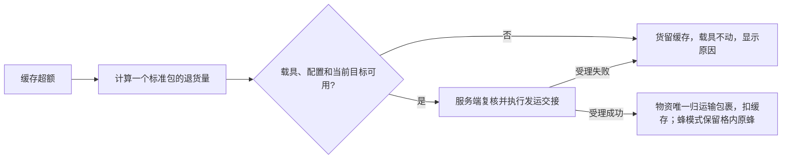

# 双运输地址与退货入口核查

核实日期：2026-08-29。对象：Minecraft **1.21.1 / NeoForge**。

状态：**公开说明与固定提交源码核查；没有创建工程、编译、启动游戏或执行兼容测试。** 本文是[项目计划书](../项目计划书.md)的技术证据，不把可调用方法等同于可交付功能，也不把研究建议升级为用户决定。

**同日最新方向：** 用户保留格内原蜂不消耗、派一次性蜂及失败原包当地掉落的规则，并明确先不专门处理蜂串网，相信玩家的建设能力，实际游玩后再观察是否需要适配。当前沿用原生选站与回退，固定初始目标、防跨网及改网即终止不再是要求；下文普通蜂入港回收仍只是上游基线，不适用于一次性蜂。尚未实现或联调，也未决定取消／后置蜂模式。

## 1. 本轮问题与结论

用户要求纸飞机和运输蜂都测试，先核对 `FMP@当前玩家名` 是否影响派送；同时恢复退货研究，提出“运输物格＋返回地址，不能出发就不打包”。

结论：**两个快照的地址解析都支持该单个 `@` 格式；两者都有可复用的真实运输入口，但各有前置条件。** 纸飞机要求活动目标登记；运输蜂要求网络成员与可达目标。两者均不提供覆盖本模组缓存、载具及运输存档的现成事务，也没有保证目的地未来始终有空位的协议。

| 项目 | 固定源码快照 | 证据范围 |
| --- | --- | --- |
| Create More: Package Couriers | `a5744d2a1bfbc505a59faba108385707d7abd472`，源码版本 2.3.0 | 地址、玩家定位、起飞受理、完整／预拆包、接收点与一次性零件 |
| Create: Mobile Packages | `46679bea2a0510f4fa939478ee917fc67e81e0a8`，源码版本 0.7.7 | 地址、网络成员、手持包裹放蜂、目标容量与回退、蜂入站回收 |

这不是“最新发布版本”声明，也不是已锁定的发布 JAR 组合。原始版本依据见[首轮审查](2026-08-28-物流系统对抗式审查.md)；进入实现时仍须对实际依赖组合复核。

## 2. 地址格式能否共用

### 运输蜂：解析可用，但有网络成员条件

**源码事实：** `CMPHelper.doesAddressMatchPlayer` 无 `@` 时比较完整玩家名，有 `@` 时比较最后一个 `@` 后面的字符串，使用精确字符串相等。因此 `FMP@Scathiard` 能识别玩家名，大小写应保持真实值。[地址解析][B1]

`PlayerTarget.fromAddress` 还检查对应网络存在、当前服务端世界中有匹配玩家，以及玩家 UUID 属于该网络的成员集合。单独知道名字或拿到别人的绑定饰品不会让接收者成为 Mobile Packages 网络成员；这条事实只约束蜂提供者资格，不否定本项目已确定的“Create 网络绑定随饰品转交”。[玩家目标][B2]

### 纸飞机：解析可用，但必须登记活动目标

**源码事实：** `CardboardPlaneManager.addPlane` 从包裹地址取第一个 `@` 后缀，同时限定实体目标；随后查询 `CourierTarget.getActiveTarget`。解析只修改局部字符串，不改包裹上的原地址。[起飞受理][P1]

`LocationTransmitterItem.inventoryTick` 在满足启用条件时更新玩家目标。目标表按服务端 tick 刷新并淘汰过期条目。只穿上本模组新饰品，不会自动得到原模组定位发信器的登记效果。[定位入口][P2]、[目标表][P3]

**实现职责：** 纸飞机适配须提供随本模组有效佩戴启停的目标登记，并避免删掉其他合法定位来源；原版已有定位发信器可用于验证基线，但不能冒充本模组饰品已具备这项兼容。权限和玩家定位仍使用提供者的真实条件。

### 共用规则及收货限制

- `FMP@当前玩家名` 只有一个 `@`，避开两个解析器“取第一个／最后一个”的差异；不附加尖括号、不用通配玩家名。
- 地址前缀本身没有发现阻碍派送的解析逻辑；完整配送是否成功仍取决于登记、权限、配置、加载与收货条件。
- 纸飞机默认 `unpack=false` 会交付完整包裹；`PRE_OPENED` 路径则逐项交付散装内容，不能再供本模组按完整包裹地址识别。当前自动入缓存的适配范围应限定完整交付，不能扫描所有散装物品补救。[飞机交付][P4]
- 蜂在玩家交付路径中检查普通背包空间并交付完整包裹。本模组不以跳过提供者的收货条件伪装兼容。[蜂港交付][B3]

**建议验收结论写法：** 分别记录“前缀解析通过静态核查”“目标登记已接入”“完整包裹游戏内交付通过”。不能把第一项合并成全部通过。

## 3. 随身退货可以借用什么

| 项目 | 纸飞机 | 运输蜂 |
| --- | --- | --- |
| 原生随身输入 | `CardboardPlanePartsItem` 是空零件；`CardboardPlaneItem` 是已经装包的飞机 | `RoboBeeItem`，可携带副手包裹生成运输蜂 |
| 发运入口 | `CardboardPlaneManager.addPlane(..., box, false)` | `RoboManager.newRobo(...)`，原物品使用逻辑会调用它 |
| 受理返回 | `false` 不加入飞行记录；`true` 已加入飞行记录，不是仅模拟 | 返回新蜂 UUID，注册运输记录；不是一个“确认目标可达”的布尔返回 |
| 可检查的出发条件 | 目标登记、目标类型允许、维度配置、目标世界存在，方块目标当时可容纳包裹 | 服务器是否允许随身携包放蜂、载具与网络、目标地址／范围／加载、蜂港同时有包裹和蜂的位置 |
| 原生载具去向 | 每包使用一个零件，飞行结束不返还零件 | 原生手持流程减少一只蜂，入站会把蜂存入蜂港；不适用于用户新选的一次性模式 |
| 原生返回目的地 | 有地址墙牌的置物台／传送带等登记目标 | 现有蜂港 |

依据：[纸飞机装包零件][P5]、[手持飞机][P6]、[起飞受理][P1]、[放蜂物品][B4]、[蜂管理器][B5]、[蜂行为][B6]。

### 纸飞机适配边界

`addPlane` 不读取或扣除玩家缓存、零件库存。它接收已经构造的包裹对象；只有目标和配置等检查通过，才创建并登记飞机。原生手动流程会先把包裹装入零件，随后尝试起飞，因此不能直接照搬该顺序来满足“不能出发就不打包”。[P1]、[P5]、[P6]

**可行推断：** 我们可以先保留玩家实物，仅生成用于检查的临时包裹描述，在同一次服务端操作中完成受理和真实扣料。需要另做失败恢复及保存顺序设计；不能先注册一架持有实物的飞机，再让异步扣库失败而无人处理。

### 运输蜂适配边界

`RoboBeeItem.useOn` 已有携带副手包裹放蜂的路径，受 `allowRoboBeeSpawnPackageTransport` 控制；该快照默认开启。不能为兼容私自改服务器配置，配置关闭就不能走此退货路径。[B4]、[B7]

`newRobo` 注册蜂，但不替调用方判断目标是否合适。`CMPHelper.getClosestBeePort`、目标对象和蜂港容量函数提供了可研究的检查入口；调用时必须按**携带包裹的蜂**检查，不能仅检查空蜂位置。[B1]、[B3]、[B5]

蜂的目标回退存在重新选择地址或其他网络港口的路径。若直接沿用原生行为，不能宣称包裹一定进入配置的那个返回站；若要保证指定地址／网络不变，需要额外适配或上游接口，不能悄悄改成自己的全局调度。[B1]、[B8]

### 追问补充：跨网回退的准确触发条件

2026-08-29，用户要求详细解释“运输蜂可能跨网改投”。本节补全此前概括省略的条件，属于源码分析而非游戏内复现；后续用户决定先沿用原生回退，将串网留待实际游玩观察，不预设专项防护。

**先区分两个字段：** 蜂保存物流网络 ID，包裹保存地址；地址匹配和网络筛选是两层条件。回退选择另一个蜂港不等于修改饰品绑定，也不要求改写包裹上的地址。

**源码事实：选站顺序。** `VirtualRobo.updateTarget` 在当前目标仍有效时保留目标。对仍携带包裹、没有匹配玩家目标的蜂，依次尝试匹配包裹地址的蜂港、已记录的出发蜂港、最后不限制地址的其他蜂港。这里最后一步是“放宽地址”，不自动等同于“放宽网络”。原生从玩家手中放出的蜂没有记录出发蜂港，因此不能假定一定会原路返还玩家。[B4]、[B8]

**源码事实：扩大网络范围的条件。** `CMPHelper.getClosestBeePort` 先读取当前维度的追踪表中属于该蜂网络的全部蜂港。仅当这份初始列表为空，才把候选扩大为追踪表中的所有网络；之后才剔除已移除、超出范围、不匹配地址或接收条件不足的蜂港，并按离蜂最近选一个。初次按地址找站仍保留地址筛选，最后无地址的回退调用才不再要求地址匹配。[B1]、[B9]

因此，**本网仍登记着蜂港、但它们恰好全满或都超出范围，不会仅因这些筛选失败而自动触发该跨网分支。** 不能把“目标满了就随机送给别的网络”当作源码结论。这里说明的是此选站函数的跨网条件，不是宣称已验证所有目标切换路径。

蜂港加载时注册，区块卸载或移除时注销。因此，“当前维度没有登记的本网蜂港”不等于“世界存档中不存在本网蜂港”。原生手持放蜂还允许未绑定蜂使用新生成的网络 ID，也会进入没有本网港的情形；本模组不能盲目照搬而漏掉正确网络校验。[B3]、[B4]、[B9]

**可复现候选，尚未实测：** 蜂携带发往 A 网络“基地退货”的包裹起飞后，A 在当前维度登记的最后一个蜂港卸载或拆除；附近仍有可接收的 B 网络蜂港。下一次重选目标时可以扩大到 B，先尝试地址匹配，失败后还可能走不限制地址的回退。成功落港后，交付函数将蜂携带的整包放入港内库存，再清空蜂的载荷；所以风险涉及真实货物，不仅是空蜂回收。[B1]、[B3]、[B6]、[B8]

**对本项目的影响：** 起飞前检查可阻止一开始就没有合法返回目标的退货，但不能提前保证飞行途中不会出现上述条件。不能把该情况夸大为所有蜂运送都会跨网，也不能让用户在尚未验证前被迫选择“接受错投”或“重做运输系统”。用户最新决定先不为此适配：原生回退继续使用，正常建设下的实际影响留给游玩观察，不据此承诺永不串网。

### 后续决定：格内蜂保留，发出一次性蜂

**用户明确方向：** 检测到运输蜂模组且运输格内有蜂，能够出发时不消耗格内原蜂，派出一只一次性蜂；完成运输交付或失去可用目标而终止时销毁临时蜂。一次性规则取代普通蜂的载具回收，但按最新决定保留原生选站与回退；不改纸飞机或正常运输蜂。

**源码事实与必须解决的差异：**

- `RoboManager.newRobo` 的现有参数没有一次性模式；它创建普通 `VirtualRobo`。现有创建参数中的“交付后回家”不能代替“交付后销毁且不产蜂”。选目标方法为私有是源码事实，但当前不再要求为防串网修改它；一次性生命周期的局部接入仍须验证。[B5]、[B8]
- 原生 `handleShutdown` 会向蜂港蜂库存插入一只蜂；`RoboEntity.hurt` 在允许玩家回收时也会把载荷及一只普通蜂交给玩家。格内原蜂保留的前提下，临时蜂必须同时阻断这些普通蜂产物出口，否则形成复制。[B6]、[B10]
- 可见蜂实体不自行保存，实际飞行由 `VirtualRobo` 和 `RoboManager` 记录与重建。只给当前实体加一次性标签不足以跨重载保留策略；一次性标记须与运输记录关联并持久化，不另加用于防串网的固定目标状态。终止时须移除运输记录与可见实体，不能只隐藏实体后又让运输记录重新生成它。[B5]、[B8]、[B10]
- 原生蜂港目标有效性合并了目标存在、区块加载、包裹容量和蜂库存容量。一次性蜂不入蜂库存，不能原样要求空蜂格；满站或区块未加载也不等于已证明目标永久消失。新模式必须区分这些条件。[B3]、[B11]

**技术方案建议，已按最新范围缩减：** 以本模组发出的任务标记区分普通蜂与一次性蜂，复用已有运输与表现；接入范围聚焦交付提交后、普通蜂物品产出、实际终止及运输记录保存／恢复。出发前保留地址、有效目标和权限检查；途中不为防串网固定蜂港、不拦截原生目标重选、不因改网额外终止。该方向不是新建全图物流调度，也不表示现成接口已经足够；若需局部注入，实施方案须列清具体位置和版本风险。

**守恒要求：** 临时蜂不是可获得的普通蜂物品。格内原蜂保留，货物仍只来自真实缓存；成功交接才扣缓存，失败不先造可取得的包裹。交付成功先将实物移入目标，再清除临时蜂，不凭到达坐标就删除载荷。玩家卸下／离线后，已发任务仍保留临时模式和终止规则，不回滚已发物资、不重新启用玩家缓存业务。

**已确认的物资处置：** 一次性蜂失去可用目标而终止时，销毁蜂，未交付原包在失败位置掉落，不自动退缓存、不复制、不赔付，不随蜂删除包裹。原目标失效后仍可由原生逻辑重选，不因换站或改网额外终止；满站、区块卸载不直接等同于永久失去目标。在未加载区块保留并落下包裹的实现还要验证，不能以强加载或静默删除绕过。

### 成本与兼容性判断：基于固定源码的推断

本轮再次核对 `newRobo`、普通蜂关机入港和纸飞机 `addPlane` 入口，仍以第 2 节固定提交为依据，不宣称覆盖其他版本。以下只比较运输适配，不估算个人缓存、界面、自动取料等核心功能的总工作量。

| 适配内容 | 可复用部分与新增责任 | 相对成本判断 |
| --- | --- | --- |
| 双运输补货接收 | 载具自行将完整包裹送入玩家背包；本模组处理专用地址、权限、拆包和数量守恒，仍须验证目标登记及完整包裹交付设置 | 与运输内部生命周期耦合较低，不因此取消双运输测试 |
| 纸飞机退货 | 已有受理成功／失败返回值、单程发运及失败落包机制；仍须实现缓存扣数、零件消耗、权限和交接验证。[P1]、[P4]、[P5]、[P6] | 比一次性蜂更接近现有行为；不是零成本或已通过联调 |
| 一次性蜂退货 | 飞行和表现有复用基础，当前不改防串网选站；仍须适配一次性交付与回收、终止落包及运输记录持久化，且不能改变普通蜂。[B5]、[B6]、[B8]、[B10]、[B11] | 较原方案减少目标锁定／回退拦截；其余生命周期仍有维护成本，不能直接沿用扩大范围时的工作量判断 |

**兼容性结论：** 当前范围已经缩减，不再将防串网的目标锁定和回退拦截计入必做工作；一次性生命周期仍需按具体版本回归验证。现有证据不支持“已经发现会与大量其他模组冲突”，也不足以给出可靠人日或确切注入数量。是否可用公共接口完成剩余接入、需要哪些局部注入，须由实施前技术方案与隔离实例验证回答。

**当前路线与观察边界：** 用户选择先信任玩家正常建设，实际游玩后再决定串网是否值得专门适配；上轮助手提出的纸飞机优先、蜂后置方案未获批准，不作为当前顺序。保留双运输补货测试和一次性蜂既定规则，不为了理论串网风险扩建运输追踪、固定目标或主动联系上游。游玩时人工记录正常使用与相关异常场景的触发条件、发生次数、货物最终去向及影响，再讨论是否增加防护；观察不等于已经验证没有问题。

## 4. “不能出发就不打包”的准确承诺

以下是本轮技术方案建议，不是已经执行的事务：

临时构造数据不等于向世界生成实物包裹。成功提交前不能留下玩家可拿走的额外包裹；成功交接后不能因迟到、路线变化或状态未知再把同一批货加回缓存。大量退货按每包最多 9 个原生堆叠槽继续分包，每包重新核查剩余超额与出发条件。

**源码不支持的保证：** 出发时有位置，不代表到达时仍有位置。纸飞机到达时的接收点已满／不存在，会走地面包裹回退；蜂会重新寻找可用目标，按最新决定当前沿用这一路径，不保证必回最初蜂港。[P4]、[B8] 同一地点有接包位置，也不代表整个网络有足够的物资存储空间。

用户要求不判断丢包和不自建运输系统继续有效。因此当前可研究承诺是**“出发受理失败不扣物”**，不能扩大成“每一笔退货都可靠签收”。退货 UI 只能报告已知的交接／发运状态；从玩家身边直接起飞时，不应误写“载具正在来取货”，也不能把受理成功写成“基地已收货”。

## 5. 残包与普通模板的补充

### 残包手拆后不能卡状态

**已确认要求：** 残包被玩家手动打开、移走、替换或耗尽后，原“等待腾位”提示应随本地物品变化清除，不应作为不存在的在途继续阻塞补货。手拆所得散装物品不是缓存现货。

**建议防线：** 到货记账和“当前本地还有残包”分开。前者每包只结算一次；后者从当前可访问的真实包裹重建，不能用一个永久布尔标记或者固定槽号替代包裹存在性。不要因为手拆又恢复待收或凭空重建包裹。

### 去掉额外数据不等于跨物品转换

**已确认方向：** 过滤模板使用同一个物品的默认状态，不维护“附魔书映射书”等跨物品表。装满物品的背包可以用于提示并设定该背包的默认空包过滤，原背包及内容保持原样。

**已核实事实：** NeoForge 1.21.1 的物品默认组件与每堆额外修改分开；构造模板应恢复默认组件，而不是把整张组件表清空。[组件文档][N1] `BOOK` 和 `ENCHANTED_BOOK` 是两个不同的物品字段，去除附魔数据不会自动把后者变成前者。[Minecraft 1.21.1 物品字段文档][N2]

**推论：** 新规则下附魔书得到的是该物品自身的默认模板。若某模组物品必须依赖额外种类数据才能有意义，普通模板可能没有实际可供库存；这不授权本模组生成物品或增加额外映射。若背包用 UUID 指向外部库存，设过滤不得读取后清空或复制其外部内容。TaCZ 数据兼容仍须通过条件目标的身份核查，见[自动取料核查](2026-08-29-自动取料兼容边界核查.md)。

## 6. 待执行的针对性验证

全部项目目前均为**未执行**，不能报告为兼容通过。

| 编号 | 条件 | 验证目标 |
| --- | --- | --- |
| A01 | 仅纸飞机、仅蜂、两者同时安装 | `FMP@真实玩家名` 完整交付，普通包裹不被接管，同一实物不被重复接收 |
| A02 | 纸飞机仅佩戴本模组饰品 | 正确登记目标；卸下／禁用／冲突时本模组不继续启用其访问，不误删其他定位来源 |
| A03 | 纸飞机完整交付与预拆包 | 完整交付可按地址处理；预拆包不误标为支持自动入缓存 |
| A04 | 蜂网络无成员权限、服务器关闭随身携包 | 不越权发货，不偷偷开启配置 |
| A05 | 退货无载具、地址无目标、禁用维度或满站 | 不生成实物包裹，不扣缓存和载具，显示可证实原因 |
| A06 | 起飞受理失败／提交中断 | 缓存、载具、真实包裹数量守恒，没有留下一架免费载货飞机／蜂 |
| A07 | 出发后目的地满、拆除或卸载 | 记录提供者实际回退，不宣称已签收，不自动补偿缓存 |
| A08 | 正常建设；本网有站但全满／超距；本网登记列表为空；途中最后一个本网港卸载／拆除；未绑定蜂携包 | 游玩观察原生回退的触发条件、频率、实际整包去向及影响；不以绝不跨网为通过条件，不由此允许本模组越权发运 |
| A09 | 连续多包与重复触发 | 一次只交接实际超额，每包遵守容量，载具消耗／转移与包数一致 |
| A10 | 残包被手拆、移动、投出、放回 | 等待腾位状态准确清除／重建，到货记账不重复，正常补货不被旧状态堵塞 |
| A11 | 有内容的背包、改名／损耗物品、附魔书 | 只生成同物默认过滤，原物与外部库存不变，无跨物品映射或物资生成 |
| A12 | 保存重载、玩家离线／死亡／换装 | 分别验证缓存与运输提供者的保存恢复边界，不把源码快照当成崩溃一致性保证 |

### 一次性蜂新增验证

以下 D01—D08 同样全部**未执行**，仅登记新方向需要证明的行为；失败原包在当地掉落已获确认，不代表具体生命周期与存档实现已经验证。

| 编号 | 条件 | 验证目标 |
| --- | --- | --- |
| D01 | 有／无运输蜂模组，运输格有／无蜂 | 模式仅在满足条件时可发运；模组缺失不加载其类、不影响纸飞机和基础缓存 |
| D02 | 单包／连续多包、启动失败、重复触发 | 格内原蜂数量不因发运减少；真实货物只交接一次；无超额时不持续生出载货蜂 |
| D03 | 正常到达、包裹格有位但蜂库存满 | 只交付真实包裹；蜂库存不因一次性蜂增加，不照搬普通蜂的蜂格容量门槛 |
| D04 | 玩家敲击、其他已支持的回收／死亡入口 | 不得到普通蜂物品；载荷按确定规则唯一处置，不复制或误改正常蜂 |
| D05 | 原目标拆除、改网／改地址，旁有其他站 | 观察原生重选结果，不额外锁定原站或禁止跨网；区分成功改投与无可用目标而终止，不误报原站签收 |
| D06 | 目的地满、目标区块卸载、载具所在区块卸载 | 分别处理暂不可用、目标消失和实体不可见；不误把所有情况当作同一种自毁 |
| D07 | 目标丢失终止、终止重复触发、包裹尚在蜂上 | 未交付原包仅在失败位置掉落一次，不随蜂删除、不自动返缓存，不在交付后再掉出第二份 |
| D08 | 保存重载、玩家离线／死亡／卸下，任务终止 | 一次性策略保留；运输记录和实体正确结束，不变普通蜂、不再次生成或恢复玩家缓存业务 |

## 来源

[B1]: https://github.com/timplay33/Create-Mobile-Packages/blob/46679bea2a0510f4fa939478ee917fc67e81e0a8/src/main/java/de/theidler/create_mobile_packages/CMPHelper.java
[B2]: https://github.com/timplay33/Create-Mobile-Packages/blob/46679bea2a0510f4fa939478ee917fc67e81e0a8/src/main/java/de/theidler/create_mobile_packages/robo/PlayerTarget.java
[B3]: https://github.com/timplay33/Create-Mobile-Packages/blob/46679bea2a0510f4fa939478ee917fc67e81e0a8/src/main/java/de/theidler/create_mobile_packages/blocks/bee_port/BeePortBlockEntity.java
[B4]: https://github.com/timplay33/Create-Mobile-Packages/blob/46679bea2a0510f4fa939478ee917fc67e81e0a8/src/main/java/de/theidler/create_mobile_packages/items/robo_bee/RoboBeeItem.java
[B5]: https://github.com/timplay33/Create-Mobile-Packages/blob/46679bea2a0510f4fa939478ee917fc67e81e0a8/src/main/java/de/theidler/create_mobile_packages/robo/RoboManager.java
[B6]: https://github.com/timplay33/Create-Mobile-Packages/blob/46679bea2a0510f4fa939478ee917fc67e81e0a8/src/main/java/de/theidler/create_mobile_packages/entities/robo_entity/RoboBeeBehaviorController.java
[B7]: https://github.com/timplay33/Create-Mobile-Packages/blob/46679bea2a0510f4fa939478ee917fc67e81e0a8/src/main/java/de/theidler/create_mobile_packages/index/config/CMPServer.java
[B8]: https://github.com/timplay33/Create-Mobile-Packages/blob/46679bea2a0510f4fa939478ee917fc67e81e0a8/src/main/java/de/theidler/create_mobile_packages/robo/VirtualRobo.java
[B9]: https://github.com/timplay33/Create-Mobile-Packages/blob/46679bea2a0510f4fa939478ee917fc67e81e0a8/src/main/java/de/theidler/create_mobile_packages/blocks/bee_port/DronePortTracker.java
[B10]: https://github.com/timplay33/Create-Mobile-Packages/blob/46679bea2a0510f4fa939478ee917fc67e81e0a8/src/main/java/de/theidler/create_mobile_packages/entities/robo_entity/RoboEntity.java
[B11]: https://github.com/timplay33/Create-Mobile-Packages/blob/46679bea2a0510f4fa939478ee917fc67e81e0a8/src/main/java/de/theidler/create_mobile_packages/robo/BeePortBlockEntityTarget.java
[P1]: https://github.com/rekales/create-more-package-couriers/blob/a5744d2a1bfbc505a59faba108385707d7abd472/src/main/java/com/kreidev/cmpackagecouriers/plane/CardboardPlaneManager.java
[P2]: https://github.com/rekales/create-more-package-couriers/blob/a5744d2a1bfbc505a59faba108385707d7abd472/src/main/java/com/kreidev/cmpackagecouriers/transmitter/LocationTransmitterItem.java
[P3]: https://github.com/rekales/create-more-package-couriers/blob/a5744d2a1bfbc505a59faba108385707d7abd472/src/main/java/com/kreidev/cmpackagecouriers/CourierTarget.java
[P4]: https://github.com/rekales/create-more-package-couriers/blob/a5744d2a1bfbc505a59faba108385707d7abd472/src/main/java/com/kreidev/cmpackagecouriers/plane/CardboardPlane.java
[P5]: https://github.com/rekales/create-more-package-couriers/blob/a5744d2a1bfbc505a59faba108385707d7abd472/src/main/java/com/kreidev/cmpackagecouriers/plane/CardboardPlanePartsItem.java
[P6]: https://github.com/rekales/create-more-package-couriers/blob/a5744d2a1bfbc505a59faba108385707d7abd472/src/main/java/com/kreidev/cmpackagecouriers/plane/CardboardPlaneItem.java
[N1]: https://docs.neoforged.net/docs/1.21.1/items/datacomponents/
[N2]: https://maven.fabricmc.net/docs/yarn-1.21.1%2Bbuild.3/net/minecraft/item/Items.html
