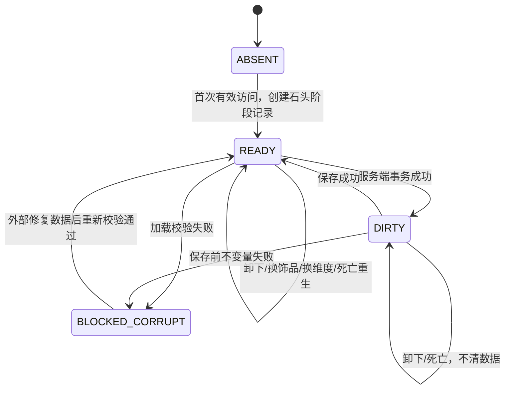

# 个人缓存与持久化规格

- **版本**：`v0.1.0`，里程碑 M1
- **优先级**：`[A] / P0`
- **平台**：Minecraft 1.21.1 / NeoForge
- **必需依赖**：玩家身份与服务端生命周期；[供应链坠与网络绑定](02-供应链坠与网络绑定.md)提供访问判定
- **被依赖**：物流格界面、自动补货与待收、按地址收包、原版／JEI 合成取料、弓弩取料
- **规格状态**：精确组件身份语义继续有效；2026-09-05 起因本件缓存／个人缓存重构而整体暂停，下方玩家单缓存与 schema 1 → 2 兼容内容只作旧测试实现记录

> **当前覆盖规则：** 新模型直接设计干净 schema，分别表达本件缓存与个人缓存，不提供旧 `test.N` schema 的双格式解码、兼容别名或迁移模块。项目尚未发布，旧测试世界允许失效但不得由代理删除。完成本规格整体重写并取得新 schema 实施授权前，不得据下方历史模型继续编码。

本规格定义玩家拥有的那一份真实物流缓存。它不定义运输提供者、包裹寻路或退货。网络绑定属于供应链坠，不得写入玩家缓存记录。

## 用户故事

> 作为玩家，我希望缓存物资、过滤、阈值、取料偏好和升级始终跟随我的玩家身份，以便更换、丢失或转交饰品以及死亡重生后，仍然访问同一份数据。

> 作为服务器管理员，我希望每次缓存变更由服务端原子提交并可保存重载，以便客户端重发、玩家断线或目标物品栏空间不足时不会复制或吞掉物资。

## 范围与明确排除

### 本规格包含

- 个人缓存的逻辑数据模型、默认值、校验和持久化语义。
- 可安全编码实物的存入、取出、精确变体过滤建立／清除、玩家升级、来源优先级与按格重置待收。
- 玩家死亡、换饰品、饰品转交、断线、重连和服务器重启时的数据归属。
- 供其他模块调用的服务端模拟、提交和只读快照边界。

### 本规格不包含

- 网络绑定和多终端冲突算法，见 `02-供应链坠与网络绑定.md`。
- 具体屏幕像素和鼠标映射，见 `03-物流格界面与五阶段.md`。
- Create 请求的受理量、包裹内容结算和运输提供者实现；这些模块只能通过本规格定义的事务接口改变缓存。
- 跨服务器、跨存档或玩家 UUID 变化时的数据迁移。
- 退货、TaCZ、无 Curios 护甲入口和正式序列组装。

## 术语与数量口径

- **缓存现货**只指 `storedCount`。普通背包、快捷栏、副手、在途、残包和远端网络库存均不计入。
- **过滤身份**是 `ItemVariantKey`：物品注册 ID＋完整持久化数据组件，数量不属于身份。同 ID 不同组件是不同变体；最终相等判断不能只用摘要或裸 ID。
- **在途数量**是防重复请求用的本地记账，不是现货，也不是载具仍存活的证明。
- 所有面向原版容器的实物输出都必须拆成该物品合法原生堆叠；内部计数较大不改变原生堆叠上限。

## 逻辑数据模型

这里定义规范模型。物理编码可以变化，但读入后的模型、默认值和约束不得变化。

### `PlayerCacheRecord`

| 字段 | 类型 | 默认值 | 约束与含义 |
| --- | --- | --- | --- |
| `schemaVersion` | `int` | `2` | 新记录写 2；解码器接受 1 并按本规格迁移，未知更高版本只读封锁 |
| `playerId` | `UUID` | 服务端当前玩家 UUID | 记录主键；不得接受客户端指定，也不得从饰品读取 |
| `tier` | `Tier` | `STONE` | 只允许按既定顺序上升，不允许降级 |
| `sourcePriority` | `SourcePriority` | `INVENTORY_FIRST` | `INVENTORY_FIRST` 或 `CACHE_FIRST`；仅是取料顺序 |
| `slots` | `List<CacheSlotRecord>` | 9 个新格 | 长度必须等于当前阶段格数；索引从 0 连续递增 |
| `pendingInbound` | `List<PendingInboundRecord>` | 空列表 | 本地待收记账；不增加现货，不按时间自动清除 |
| `packageJournal` | `List<PackageJournalEntry>` | 空列表 | 活动收包事务日志；最多 256 条且编码后最多 256 KiB，终态在下一次成功保存后清理 |
| `revision` | `long` | `0` | 每次成功事务加 1；失败、模拟和只读操作不增加 |

### `Tier`

| 枚举值 | 顺序 | 格数 | 单格容量 |
| --- | ---: | ---: | ---: |
| `STONE` | 0 | 9 | 128 |
| `IRON` | 1 | 16 | 256 |
| `ANDESITE` | 2 | 24 | 512 |
| `BRASS` | 3 | 30 | 1,024 |
| `STURDY_SHEET` | 4 | 36 | 2,048 |

阶段容量是所有已解锁格共同采用的当前上限。升级只扩容并在列表末尾追加空格，不重排旧格。

### `CacheSlotRecord`

| 字段 | 类型 | 默认值 | 约束与含义 |
| --- | --- | --- | --- |
| `index` | `int` | 创建顺序 | `0 <= index < slots.size`，且等于列表位置 |
| `filter` | `ItemVariantKey?` | `null` | 空格无过滤；非空时同一精确变体在该玩家范围内唯一 |
| `storedCount` | `long` | `0` | `0 <= storedCount <= tier.capacity` |
| `minimum` | `ThresholdSetting` | `{enabled:false,value:0}` | 补货阈值；首版会驱动补货 |
| `maximum` | `ThresholdSetting` | `{enabled:false,value:创建时容量}` | 退货阈值；首版保存和显示，但不启动退货 |
| `filterRevision` | `long` | `0` | 每次建立、更换或清除过滤时加 1；延迟任务必须携带并复核 |

### `ItemVariantKey`

| 字段 | 类型 | 约束与含义 |
| --- | --- | --- |
| `itemId` | `ResourceLocation` | 必须解析到当前注册表中的物品；不能是空气或包裹外壳 |
| `components` | 完整持久化数据组件快照 | 使用注册表感知 `ItemStack` 编解码；数量先规范化为 1，往返后身份必须完全相同 |

`ItemVariantKey` 是不可变值对象，不直接暴露可变 `ItemStack`；运行时生成物品时返回防御性副本。相等语义等价于同物品且完整组件相同。规范模板编码不得超过 1,024 字节；摘要只用于日志、定位或快速比较，发生摘要相同时仍须核对完整身份。默认无额外修改的物品只是精确变体的一种，不具有特殊降级地位。

### `ThresholdSetting`

| 字段 | 类型 | 约束与含义 |
| --- | --- | --- |
| `enabled` | `boolean` | `false` 表示该方向关闭；关闭的最低／最高值必须分别为 0／当前容量 |
| `value` | `long` | `0 <= value <= tier.capacity` |

当两个端点均启用时必须满足 `minimum.value <= maximum.value`。只有一端启用时仍校验其值不超过容量。任何关闭操作都立即把最低／最高端分别规范化为 0／当前容量；服务端忽略客户端随关闭意图携带的其他数值。升级时，启用端点保留原值，关闭的最高端更新为新容量；新增格使用同样的关闭端点默认值。

### `PendingInboundRecord`

| 字段 | 类型 | 约束与含义 |
| --- | --- | --- |
| `requestId` | `UUID` | 玩家记录内唯一；用于防重复登记同一次服务端请求 |
| `itemKey` | `ItemVariantKey` | 请求时的完整过滤身份，不随格子后来改过滤而改写 |
| `remainingCount` | `long` | `1..tier.capacity`；是尚未结算的本地数量，不是实物 |
| `sourceNetworkId` | `UUID` | 请求发生时的 Create 网络；只供请求校验和诊断，不授予访问权限 |
| `originSlotIndex` | `int` | 请求发生时的格索引；只供定位和诊断，不作为物品身份 |
| `filterRevision` | `long` | 请求发生时的过滤版本；旧版本记录不能覆盖新过滤缺口 |
| `submittedGameTime` | `long` | 仅供排序和诊断；不得据此超时、赔付或重发 |

同一 `requestId` 只能登记一次。每个精确变体最多保留 4 条活动记录，全玩家最多 144 条；创建第 5 条前，将同一 `itemKey`、同一过滤版本、同一来源网络的新承诺量安全合并进最新记录，无法合并则拒绝本次请求。记录结算为 0、按格手动重置或清除该空格过滤后立即从活动表删除，只写结构化诊断日志，不持久化历史。清过滤不会撤回真实包裹，也不会把旧记录改成新变体；补货模块只用与当前 `itemKey` 和 `filterRevision` 同时匹配的记录覆盖当前缺口。

### `PackageJournalEntry`

| 字段 | 类型 | 约束与含义 |
| --- | --- | --- |
| `operationId` | `UUID` | 玩家记录内唯一的整包收包事务 ID；一个包裹的一次多物品处理只写一条 |
| `receiptId` | `UUID` | 对应包裹上的本模组收据 ID |
| `movedToCache` | `Map<ItemVariantKey,long>` | 本次各精确变体的真实转入量；允许为空，但所有值必须为正 |
| `settledInbound` | `Map<ItemVariantKey,long>` | 本次首次到达对活动待收的实际结算量；允许为空，不是实物 |
| `packageBeforeDigest` / `packageAfterDigest` | `byte[]` | 包裹地址、收据和完整内容的规范摘要，用于重载核对 |
| `playerBeforeDigest` / `playerAfterDigest` | `byte[]` | 涉及的缓存格、待收和修订号规范摘要，用于发现跨快照写入 |
| `phase` | `PREPARED / COMMITTED` | 只允许单向提交；发现 `PREPARED` 重载时封锁自动收包并报告 |

每玩家最多 256 条活动日志，序列化后总计不得超过 256 KiB；先达到任一上限就暂停新收包事务，原包和缓存保持不变并提示等待安全保存。`COMMITTED` 条目须等到下一次玩家附件与物品栏均成功保存后清理。日志按整包事务记录，不能把一个最多 9 槽的原子处理拆成彼此无关的逐物品日志。摘要只用于判定与诊断，不能据摘要猜造或删除实物；目标保存模型若不能让四个故障切点保持物资总量不变，`SPK-DATA-01`／`SPK-PKG-01` 必须失败并阻塞发布。

## 不变量

每次加载和事务提交都必须检查以下不变量：

1. 一个世界存档内，每个 `playerId` 只有一份 `PlayerCacheRecord`。
2. `slots.size` 精确等于 `tier` 对应格数；索引连续且不重复。
3. 同一个非空 `ItemVariantKey` 在 `slots` 中最多出现一次；同 ID 不同组件允许分别存在。
4. `filter == null` 时，`storedCount == 0`，两端必须关闭；不存在“无身份的真实物资”。
5. 关闭的最低端值必须为 0，关闭的最高端值必须为当前容量；不存在隐藏的停用阈值。
6. `storedCount` 不得超过当前阶段容量；加载到超容量记录时禁止访问，不自动截断或掉落物资。
7. 已有真实库存时不得更改或清除过滤；必须先取到 `storedCount == 0`。
8. 阈值数值不充当实际容量；关闭最高数量仍不能超容量存入。
9. 待收记录不加入 `storedCount`，不用于合成或取箭，也不因死亡、卸下、换网或超时自动清除；活动记录上限必须满足本节约束。
10. 活动事务日志不得超过 256 条或 256 KiB，非终态日志不得被自动猜测、清除或重放。
11. 饰品数据不得包含 `PlayerCacheRecord`、阶段、取料偏好或任何缓存物资。
12. 任何事务的缓存增量必须等于来源成功减少量；缓存减量必须等于目标成功增加量或受支持操作的真实消费量，且转移前后 `ItemVariantKey` 完全相同。
13. 每个模板规范编码不超过 1,024 字节；解码、保存重载和网络往返不得改变完整身份。

## 服务端接口：输入与输出

客户端只提交意图。以下所有接口从当前服务端连接取得玩家身份，并先调用终端访问判定；输入中没有 `playerId`。

### 输入

| 意图 | 字段 | 前置条件 | 成功效果 |
| --- | --- | --- | --- |
| `OpenCacheIntent` | `expectedMenuId:int` | 有有效访问或处于可解除的网络冲突管理态 | 返回只读快照；冲突态不返回可操作库存 |
| `DepositIntent` | `slotIndex:int`、`sourceLocator`、`requestedCount:long`、`expectedRevision:long` | 目标有相同精确过滤，或目标为空且来源实物可安全编码 | 按容量和来源实际可取量存入；空格同时建立精确过滤 |
| `WithdrawIntent` | `slotIndex:int`、`targetLocator`、`requestedCount:long`、`expectedRevision:long` | 有有效访问，目标能接收合法堆叠 | 按目标实际接收量扣减 |
| `SetFilterIntent` | `slotIndex:int`、`sourceKind:INVENTORY/JEI`、`sourceLocator?`、`ghostItemKey?`、`expectedRevision:long` | 空格、库存为 0、同一精确变体未占其他格；INVENTORY 由服务端读取来源，JEI 模板有界且可往返 | 设置完整模板；只有真实背包来源可同时转入实物 |
| `ClearFilterIntent` | `slotIndex:int`、`expectedFilterRevision:long`、`expectedRevision:long` | `storedCount == 0` 且格过滤版本未变 | 清过滤、关闭两端并删除该精确变体的活动待收；不撤回旧包 |
| `SetThresholdIntent` | `slotIndex:int`、`side:MINIMUM/MAXIMUM`、`enabled:boolean`、`value:long`、`expectedRevision:long` | 值合法且两端不交叉 | 更新一个端点 |
| `ResetInboundIntent` | `slotIndex:int`、`expectedFilterRevision:long`、`expectedRevision:long` | 该格仍是预期过滤版本 | 删除该格当前精确变体的本地待收记录，不改实物 |
| `SetSourcePriorityIntent` | `priority:SourcePriority`、`expectedRevision:long` | 有有效访问 | 更新玩家偏好，不搬动物资 |
| `ApplyTierUpgradeIntent` | `targetTier:Tier`、`upgradeSourceLocator`、`expectedRevision:long` | 恰为下一阶段，升级凭证验证通过 | 成功消费凭证后扩容并追加空格 |

`sourceLocator` 和 `targetLocator` 是当前服务端菜单中的受控槽位引用；不得接受任意物品数量、任意容器或客户端构造的 `ItemStack` 作为实物来源。只有 JEI ghost 可以携带模板，没有实物扣减含义；其规范编码不超过 1,024 字节，整个 C2S 意图仍不得超过 8 KiB。

### 输出

所有变更统一返回：

| 字段 | 类型 | 含义 |
| --- | --- | --- |
| `status` | `MutationStatus` | 成功或下表中的精确错误码 |
| `committedCount` | `long` | 本次实际移动／消费数量；非数量操作为 0 |
| `newRevision` | `long` | 成功后的服务端版本；失败时为当前版本 |
| `changedSlots` | `List<CacheSlotSnapshot>` | 服务端确认后的变更格；失败时可为空 |
| `messageKey` | `String` | 本地化消息键，不携带物资决定 |

只读 `CacheSnapshot` 必须包含 `tier`、阶段容量、来源优先级、全部已解锁格、当前过滤相关待收数量和 `revision`。客户端显示计数不得成为下一次提交的可信来源。

## 服务端事务边界

### 通用提交协议

1. 在玩家所属服务端线程读取实际玩家、当前菜单和当前佩戴状态。
2. 调用 `02` 的访问判定；无佩戴、全部禁用或网络冲突时拒绝物资／配置操作。内部保存不受佩戴限制。
3. 比较 `expectedRevision`；不相等则返回 `STALE_REVISION` 和新快照，不做部分提交。
4. 在不改真实状态的情况下模拟来源提取、目标接收、容量、过滤唯一性和合法堆叠。
5. 得到唯一的 `committedCount`；为 0 时返回相应错误，不改任一侧。
6. 在同一服务端事务中提交来源与缓存或缓存与目标的等量变化；只按目标实际接受量扣缓存。
7. 验证不变量，`revision` 加 1，标记玩家记录需要保存，再发送服务端结果。
8. 缓存数量减少后，物流模块先检查玩家背包内已有专用残包并实际续收，再按更新后的现货与待收判断补货。该后处理不能回滚已完成的玩家取出事务，也不能重复扣取出量。

同一菜单意图因网络重发再次到达时，旧 `expectedRevision` 必须失败，因此不得执行第二次。任何“查询可否取料”“配方预览”“弓箭查询”只运行模拟步骤，不得进入第 6 步。

### 首次初始化

第一次在服务端确认玩家具备有效供应链坠访问时创建记录：`STONE`、9 个空格、每格容量 128、取料偏好 `INVENTORY_FIRST`、两端关闭、待收为空。制作或获得第二件饰品不得再次初始化。

### 存入

- 真实实物存入空格时，服务端从实际来源栈生成精确 `ItemVariantKey`；设置 `filter` 与真实转入必须是一个事务。如果提交前来源身份或数量改变，二者都不发生。
- 向已有格存入时，来源物品必须与格模板同物且完整组件相同；同 ID 不同组件不得借裸 ID 混入，也不得剥数据后存入。
- 可存量为 `min(requestedCount, sourceExtractable, capacity - storedCount)`。剩余物资留在来源。
- JEI ghost 只允许设置精确过滤，`committedCount` 必须为 0，不能访问或减少背包物品；旧二次确认流程取消。

### 取出与消费

- 可取量为 `min(requestedCount, storedCount, targetAcceptable)`；目标接口按该精确模板的原生堆叠上限接收，生成栈的完整组件必须与模板相同。
- 目标只能接收部分时，只扣已接收部分；完全不能接收时缓存不变。
- 合成／弹药模块的实际消费必须提供服务端提交凭证或在同一调用内完成；模拟、取消、失败结果均不扣缓存。

### 升级

升级仅允许 `STONE → IRON → ANDESITE → BRASS → STURDY_SHEET`。事务先验证下一阶段和升级凭证，再形成“阶段扩容＋生存模式消费 1 件”的原子计划；具有原版 `instabuild` 能力时消费量为 0。任一步失败都不消费、不扩容。升级不得修改旧格过滤、现货、启用状态、待收或来源优先级；启用端点保留原值，关闭的最低／最高端分别规范化为 0／新容量。

### 按格重置待收

服务端在提交瞬间重新读取该格过滤及 `filterRevision`。若与意图期望不一致则返回 `FILTER_CHANGED`。成功时只删除该格当前 `ItemVariantKey` 与过滤修订匹配的活动 `PendingInboundRecord`；现货、过滤、网络绑定和世界中的真实包裹均不变，旧包迟到后仍按实际地址和内容处理。

## 生命周期状态机



死亡、重生、饰品遗失和 `keepInventory` 开关不得触发 `ABSENT` 或创建第二份记录。`BLOCKED_CORRUPT` 时禁止所有会移动物资的操作，保留原始数据与诊断，不以空记录覆盖。

## 错误状态

| 错误码 | 触发条件 | 玩家看到什么 | 服务端处理 |
| --- | --- | --- | --- |
| `ACCESS_INACTIVE` | 未佩戴或所有供应链坠被禁用 | 未佩戴时无界面；全部禁用时仅显示终端管理 | 不读取可操作缓存，不提交物资事务 |
| `NETWORK_CONFLICT` | 多件启用终端绑定不同网络 | 只显示冲突管理入口 | 暂停缓存存取、取料、收包与物流 |
| `STALE_REVISION` | 客户端快照落后 | 刷新界面 | 不做部分提交，返回新版本 |
| `INVALID_SLOT` | 索引越界或升级后快照不一致 | “物流格已变化” | 拒绝并记录限频诊断 |
| `DUPLICATE_FILTER` | 其他格已有同一完整 `ItemVariantKey` | 定位并高亮已有格 | 来源不变，不设置新格；同 ID 不同组件不触发 |
| `FILTER_MISMATCH` | 实物与格过滤不同 | “物品与过滤不匹配” | 来源和缓存不变 |
| `FILTER_NOT_EMPTY` | 非空格尝试改／清过滤 | “请先取空此格” | 不改过滤或物资 |
| `ITEM_TEMPLATE_TOO_LARGE` | 数量为 1 的规范模板编码超过 1,024 字节 | “物品数据过大，无法存入物流缓存” | 来源不变，不建过滤、不发请求 |
| `ITEM_TEMPLATE_UNSAFE` | 模板无法完整编解码、往返后身份改变或属于禁止的包裹外壳 | “该物品数据无法安全存入物流缓存” | 来源不变，不剥组件、不降级默认实例 |
| `CAPACITY_FULL` | 无可存空间 | “缓存已满” | 物品留在来源 |
| `TARGET_FULL` | 光标／背包／操作目标不能接收 | “没有可用空间” | 缓存不扣减 |
| `INVALID_THRESHOLD` | 越界或启用的两端交叉 | 标出非法字段 | 阈值保持原值 |
| `FILTER_CHANGED` | 重置或编辑期间过滤已变化 | 刷新目标格 | 不清待收、不改其他数据 |
| `INVALID_UPGRADE_ORDER` | 跳级、重复升级或已满级 | 显示当前与目标阶段 | 不消费升级凭证 |
| `DATA_CORRUPT` | 记录不满足不变量或无法解码 | “个人物流数据需要修复” | 只读封锁，保留原始数据和日志 |
| `SAVE_FAILURE` | 持久化后端报错 | 管理员日志与玩家持续警告 | 保留内存状态并阻止安全关服被误报为已保存；不得清空记录 |

## 边界条件

- **玩家死亡**：同一 UUID 继续引用同一记录；缓存不掉落、不复制，待收不重置。
- **饰品转交**：饰品中的绑定随物品走；A、B 各按自身 UUID 访问自己的缓存。
- **无饰品或仅在背包**：记录仍保存，但所有玩家主动缓存操作失败；原版背包行为不受影响。
- **切换维度和重连**：重新绑定服务端玩家会话，不复制记录；旧客户端修订号失效。
- **服务器重启**：全部字段精确恢复；重启本身不触发补偿、重置或重复初始化。
- **玩家改名**：缓存以 UUID 为主键，不随显示名分裂；包裹地址显示名问题由收包规格处理。
- **超大或负数输入**：在任何算术前校验，使用有界 `long` 运算；非法值整笔拒绝。
- **被移除的注册物品**：记录进入 `BLOCKED_CORRUPT` 的受控诊断状态；不得把未知物品转换成空气并丢失计数。
- **组件发生变化**：使用后的实物若组件不再等于原格，就是另一变体；没有对应格时保持在来源，不做范围匹配。
- **有界模板**：同 ID 的不同组件可分别占格，但每格模板仍须满足 1,024 字节上限；36 格完整快照必须小于 64 KiB。
- **容量变化**：首版只有升级没有降级，因此不存在合法溢出路径；任何加载时溢出都视为损坏。
- **客户端断开**：已在服务端提交的事务保留，未提交意图无效；不得按客户端是否收到响应来补发物资。
- **残包等待**：不在玩家记录中保存“某个背包槽必然存在残包”的真值；每次启用和缓存腾位时从当前真实物品重新发现，避免手拆／移走后留下假状态。

## 技术 Spike

### `SPK-DATA-01`：玩家附件保存语义

**问题**：NeoForge 1.21.1 的可序列化玩家 Data Attachment 在启用 `copyOnDeath` 后，能否让缓存与原版玩家物品栏在死亡克隆、换维度、断线和专服重启中保持唯一且一致？

**固定方案**：`PlayerCacheRecord` 只保存在玩家 Data Attachment 中，开启 `copyOnDeath`；不再建立 `SavedData` 副本。Spike 失败时停止 M1 并修正同一方案的序列化／生命周期接入，不静默换成双权威存储。

**实施后验证命令**：

```powershell
.\gradlew compileJava
.\gradlew test --tests "*PlayerCachePersistenceTest"
.\gradlew runGameTestServer
```

**证据**：提交载体选择说明、序列化样例、自动测试报告，以及隔离专服中“写入 → 死亡 → 换维度 → 停服 → 重启 → 回读”的前后计数和修订号记录。

**通过门槛**：全过程只出现一份记录；36 格满级数据、阈值、待收、事务日志和来源偏好逐字段相同；死亡和重启不产生第二份库存；保存失败能显式报错且不以空数据覆盖。任一不满足即阻塞 M1，不允许用未验证候选绕过。

### `SPK-DATA-02`：精确组件身份与有界模板

**问题**：如何把真实来源栈规范化为不可变、数量为 1 的 `ItemVariantKey`，保证保存、网络同步和重新生成实物后完整组件不变，同时守住载荷上限？

**实施后验证命令**：

```powershell
.\gradlew test --tests "*ItemVariantKeyTest"
.\gradlew runGameTestServer
```

**证据**：普通方块、原生最大堆叠为 1／16／64 的物品、不同气量背罐、附魔／耐久变体、含内联内容和 UUID 组件的测试栈；每例记录规范编码长度、编码前后身份、存取前后组件散列、同 ID 异组件比较结果。另构造 1,024 与 1,025 字节边界模板并测满 36 格快照。

**通过门槛**：可编码组件实物完整入库和还原；同 ID 异组件不相等且可分别建格；同一精确变体重复过滤被拒绝；1,024 字节可用、1,025 字节整笔拒绝；C2S 小于 8 KiB、36 格快照小于 64 KiB。任一组件被删除、默认化、跨变体串货，或拒绝时来源改变，即失败并阻塞过滤实现。

### `SPK-DATA-03`：schema 1 → 2 无损迁移

**问题**：旧 schema 1 只保存 `itemId`，如何在不清档、不改数量和不重复结算包裹的情况下迁移为完整变体键？

**固定方案**：解码器显式接受 schema 1 和 2。schema 1 的过滤、待收与日志物品键统一转换为对应物品的默认精确变体；其他字段逐值保留。迁移在内存中完成，只有完整校验和后续保存成功才写 schema 2；不存在的注册物品或非法模板使整份记录进入可诊断封锁，不跳项、不创建空记录。

**通过门槛**：固定 schema 1 玩家夹具经过“加载 → 保存 → 新 JVM 回读”后写为 schema 2；格数、数量、阈值、阶段、偏好、请求 ID、待收量、过滤修订、日志、收据摘要和总修订号均保持；同一旧档重复迁移结果相同；故障夹具保留原始数据且不生成空缓存。死亡复制、换维度与专服重启各跑一次。

## Given / When / Then 验收

1. **Given** 玩家 A 从未建立记录，**When** A 首次有效佩戴供应链坠并打开缓存，**Then** 服务端只创建一份 `STONE` 记录，含 9 个空格、容量 128、背包优先和关闭的双端。
2. **Given** A 已有物资和配置，**When** A 换上另一件供应链坠，**Then** 看到完全相同的记录且没有第二份库存。
3. **Given** A 把已绑定饰品交给 B，**When** B 佩戴，**Then** B 只能看到 B 的记录；A 的现货、阶段和偏好均未转移。
4. **Given** A 的缓存含 127 件物品，**When** A 存入 5 件且容量为 128，**Then** 缓存只增加 1，来源保留 4，总量守恒。
5. **Given** 缓存有 100 件且目标只能接收 17 件，**When** 请求取出 64，**Then** 目标增加 17、缓存减少 17，不生成非法堆叠。
6. **Given** 其他格已有完全相同组件的石头过滤，**When** 从背包或 JEI 向空格设置同一变体，**Then** 返回 `DUPLICATE_FILTER`、高亮原格，来源与新格不变。
7. **Given** 某格有 1 件现货，**When** 尝试清除或更换过滤，**Then** 返回 `FILTER_NOT_EMPTY`，物资与过滤不变。
8. **Given** 某格现货为 0 且仍有旧物品待收，**When** 玩家清除过滤再设置新物品，**Then** 旧本地待收随清除操作删除、新过滤生效，旧真实包裹不被撤回；迟到旧物品没有匹配格时留在原包。
9. **Given** 待收 32，**When** 玩家按该格重置，**Then** 本地待收变为 0，缓存和世界中的旧包不变；旧包迟到仍可按实物处理。
10. **Given** 玩家只改变普通背包数量，**When** 补货模块读取现货，**Then** `storedCount` 不变，缺口只按缓存计算。
11. **Given** 玩家死亡且 `keepInventory` 分别开／关，**When** 重生并重新获得有效佩戴，**Then** 缓存、格子、阈值、待收、偏好和阶段逐字段不变。
12. **Given** 玩家卸下、丢失或销毁饰品，**When** 之后获得另一件并佩戴，**Then** 原记录恢复，不因饰品消失删除或重建。
13. **Given** 同一提交包被客户端重复发送，**When** 第二次携带旧 `expectedRevision` 到达，**Then** 返回 `STALE_REVISION`，只发生一次真实移动。
14. **Given** 玩家从石头升级到铁，**When** 凭证事务成功，**Then** 原 9 格数据不变、追加 7 个空格、所有格容量变为 256，阶段只上升一次。
15. **Given** 升级凭证在提交前消失，**When** 服务端提交，**Then** 升级失败，既不扩容也不消费其他物品。
16. **Given** 玩家设置来源优先级为缓存优先，**When** 换饰品、死亡、重连和重启，**Then** 仍为缓存优先；未佩戴期间该偏好不参与原版操作。
17. **Given** 保存数据含重复过滤、负数或超容量计数，**When** 服务器加载，**Then** 记录进入受控封锁，不截断、不转换、不用空记录覆盖。
18. **Given** 服务端重启前记录修订号为 `R`，**When** 重启后首次读取，**Then** 修订号和所有逻辑字段与停服前相同，不自动发放或扣除物资。
19. **Given** 满气与半气铜背罐具有同一物品 ID，**When** 分别从背包设过滤，**Then** 建立两个精确变体格；任一格存取后气量组件逐值不变，半气背罐不能存入满气格。
20. **Given** 某精确变体已有一格，**When** JEI 提交相同变体而另一同 ID 异组件变体也存在，**Then** 只拒绝前者的重复格，后者可独立建格且库存仍为 0。
21. **Given** 规范模板编码分别为 1,024 与 1,025 字节，**When** 建格，**Then** 前者按正常规则处理，后者返回 `ITEM_TEMPLATE_TOO_LARGE`，来源、过滤和缓存不变。
22. **Given** 一份合法 schema 1 记录含现货、阈值、待收和包裹日志，**When** 加载并跨 JVM 保存回读，**Then** 写为 schema 2，所有旧物品键成为默认精确变体，数量与事务身份不变且迟到包不会二次结算。
23. **Given** schema 1 含已移除物品 ID，**When** 尝试迁移，**Then** 整份记录进入 `BLOCKED_CORRUPT`，原始数据不被空记录覆盖，也不跳过该格继续保存。

## 当前验证状态

旧 schema 1 的 T03 曾达到 42/42 JUnit、10/10 GameTest，并通过默认组件矩阵、随机守恒、死亡／维度复制、压缩玩家文件和跨 JVM 回读，证据见 [T03 个人缓存与事务验证](../../research/2026-08-30-T03个人缓存与事务验证.md)。2026-09-04 决策替换了其物品身份模型，因此这些结果只作为迁移回归基线；`ItemVariantKey`、schema 2、`SPK-DATA-02/03` 及新增验收尚未执行，T03 受影响部分重新打开。
