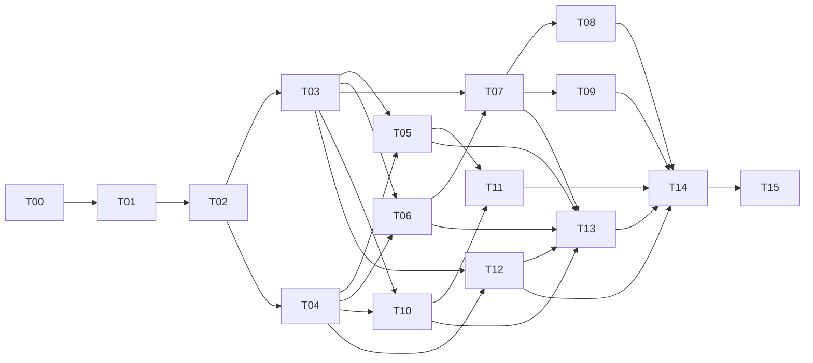

# 任务拆分

- **计划版本**：plan-v1.0
- **目标发布**：`v0.1.0`
- **估算口径**：S＝局部且接口稳定，M＝跨两个模块，L＝跨存档／菜单／第三方边界；不提供未经实测的工时
- **执行状态**：旧任务表保留为 `test.12` 历史；2026-09-05 本件／个人缓存、1—5 级、序列升级和插件舱重写中，受影响实现暂停；实时进度见[开发状态](../开发状态.md)

## 0. 2026-09-05 新模型暂停与重排入口

1. 精确组件 `ItemVariantKey` 语义继续保留。
2. 新缓存模型直接使用干净 schema 与新 1—5 级物品表，不增加旧 `test.N` schema 迁移器、双格式解码或旧升级件兼容别名。
3. 旧世界允许失效但不得由代理删除；旧 schema 1→2 测试只作为已经执行的工程历史，不再是最终交付门。
4. T02—T07、T10—T12 中受缓存所有权、寻址、等级、插件舱或新 schema 影响的部分继续暂停。完成权威规格重写、只读入口验证和实施授权后，另写新的依赖顺序与验收门。
5. 下方“2026-09-04 重开队列”及旧 T00—T15 仅说明 `test.12` 之前如何实施；与本节冲突时不得执行。

## 历史：2026-09-04 重开队列

旧 `test.9` 的构建与测试结果仍是已执行事实，但它验证的是裸 `itemId`／默认模板数据模型，并且 T12 的测试把纯弹药查询扣料写成了通过条件，不能作为当前规格的完成证据。执行者按下列依赖顺序修订，不以一次横跨所有模块的大改替代逐层门禁：

1. **T02**：为规范化 `ItemVariantKey`、有界模板载荷与完整快照建立 codec／协议门。
2. **T03**：升级玩家缓存至 schema 2，实现 schema 1 无损迁移、精确变体唯一性和全事务共用键。
3. **T05／T11 ghost**：显示并提交完整组件模板，取消默认化与二次确认；同 ID 异组件可分别设格。
4. **T06／T07**：Create 查询／请求、待收、收据、残包和日志全部改用精确变体并保持组件原样。
5. **T10／T11 transfer**：配方候选、模拟与提交按精确组件实物工作；JEI 仍只是客户端意图入口。
6. **T12**：在真实弓释放／弩装填提交点单扣，纯查询与取消零扣；缓存弹药原样保留组件。
7. **T13—T15**：补齐迁移、组件矩阵、性能和真实游戏流程证据后再恢复最终交付门。

T04 的终端绑定、T08／T09 的原生运输研究以及与物品身份无关的既有证据不因本次变更自动作废；若其后续流程接触缓存模板，则仍须使用新接口复测。

## 1. 依赖主链

## 2. 任务总表

| ID | 任务 | 依赖 | 复杂度 | 主要交付物 | 完成证据 |
| --- | --- | --- | --- | --- | --- |
| T00 | 实施授权与执行边界登记 | 无 | S | 授权范围与红线记录 | 明确允许进入实现；未捆绑发布或系统修改授权 |
| T01 | NeoForge 工程骨架 | T00 | M | 可编译工程、依赖声明、运行配置 | 必需依赖解析；C0 客户端／专服启动 |
| T02 | 注册、数据组件与网络协议 | T01 | L | 物品／升级注册、codec、payload、翻译键 | 编解码回环、payload 限额、专服无客户端类 |
| T03 | 个人缓存与事务内核 | T02 | L | 玩家附件、格、阈值、升级、审计 | 单元／GameTest 守恒与保存重载通过 |
| T04 | 供应链坠与网络绑定 | T02 | L | Curios、绑定／清绑／禁用、冲突归并 | 佩戴、绑定转交与缓存隔离矩阵通过 |
| T05 | 物流面板与五阶段交互 | T03、T04 | L | 背包面板、实物过滤目标、滑条、状态、简化配方 | UI 40 组矩阵与输入测试通过 |
| T06 | 补货协调与 Create 请求 | T03、T04 | L | 缺口、退避、请求承诺、待收；不设运输资格门 | 0／部分／足量和重复触发通过 |
| T07 | 本地包裹接收与残包 | T03、T06 | L | 扫描、收据、部分入库、事务日志 | 9 槽、残包、重复扫描、故障切点通过 |
| T08 | 纸飞机原生运输联调 | T07 | L | 现有流水线验证记录与原生配置说明，不预设适配代码 | 单装真实完整包闭环通过 |
| T09 | 运输蜂原生运输联调 | T07 | L | 原生派送验证记录与配置说明，不预设适配代码 | 原生成员规则未被干预，单装真实闭环通过 |
| T10 | 原版配方书取料 | T03、T04 | L | 2×2／3×3 转移服务 | 混合来源、批量、余物和取消守恒 |
| T11 | JEI 过滤与配方转移 | T05、T10 | M | JEI 插件、ghost、recipe transfer | C1 与 C4 的 JEI 路径通过 |
| T12 | 通用投射物弹药取用 | T03、T04 | L | 共享消费服务、标准投射物查询／提交适配 | 非原版标准链物品自动兼容；取消零扣、成功单扣、弩不重扣 |
| T13 | 系统测试、安全与性能 | T05—T07、T10、T12 | L | 属性测试、GameTest、审计、基准 | 非功能门逐项有报告 |
| T14 | 兼容矩阵与游戏内验收 | T08、T09、T11—T13 | L | C0—C5、多人、双运输记录 | 全矩阵通过且无 P0／P1 |
| T15 | `v0.1.0` 本地交付 | T14 | M | JAR、依赖、变更、验证记录 | 用户要求交付后生成并核对 `release/v0.1.0/` |

## 3. 逐任务执行规格

### T00：实施授权与执行边界登记

**输入**：本计划、项目规则、用户明确的开始实现授权。

**工作**：记录获准范围、工作目录、允许创建的工程结构和仍需单独询问的红线。开始实现授权不自动包含全局安装、系统配置、Git push、公开发布或删除操作。

**完成**：授权边界写入项目状态，且能直接进入 T01；没有借授权预先执行任何红线操作。

### T01：NeoForge 工程骨架

**输入**：T00 基线；`mod_id=create_feed_me_packages`、group `dev.scathiard`、package `dev.scathiard.feedmepackages`、版本 `0.1.0`、MIT。

**工作**：建立 Gradle/NeoForge 结构，只声明 Create／Curios 模组依赖；JEI／双运输不写入依赖元数据，后续使用隔离兼容入口。建立客户端与服务端分离入口、GameTest source set 和许可证文件；完成 `SPK-DEP-01`、`SPK-DEP-02` 与初始 `SPK-LIC-01`。

**完成**：依赖报告无版本漂移；C0 客户端、专服和 GameTest Server 空载启动；缺 Create／Curios 为加载器明确拒绝；可选模组缺失不加载其类。

### T02：注册、数据组件与网络协议

**输入**：[架构设计](架构设计.md)第 4、8、10 节。

**工作**：注册供应链坠、四级升级物品、`TerminalConfig`、`PackageReceipt`、菜单／屏幕、payload 和中英文键；为规范化 `ItemVariantKey`、精确模板及 schema 2 快照实现有界 codec 与服务端意图校验。

**完成**：默认值、精确组件模板与坏数据编解码测试通过；单模板不超过 1,024 B、C2S 小于 8 KiB，36 个近上限模板的完整 S2C 仍小于 64 KiB；专服 classpath 不触及 GUI／JEI 客户端类。

**实施状态（2026-09-04）**：旧协议基线曾完成，证据见 [T02 注册与协议验证](../research/2026-08-30-T02注册与协议验证.md)；精确模板载荷与新快照尚未实现／复测，受影响部分重新打开。

### T03：个人缓存与事务内核

**输入**：[个人缓存规格](specs/01-个人缓存与持久化.md)。

**工作**：实现 Data Attachment、`copyOnDeath`、缓存服务、修订号、模拟／提交、完整 `ItemVariantKey` 过滤、五阶段、来源偏好、待收和日志上限、只读审计；解码 schema 1／2，把 schema 1 的过滤、待收和日志键无损迁移到当前默认精确变体，下一次成功保存写 schema 2。

**完成**：规格全部 Given／When／Then 自动化；随机事务序列守恒；死亡、维度、重连、重启逐字段一致；坏数据封锁且不覆盖。

**实施状态（2026-09-04）**：schema 1／默认模板基线曾达到 42/42 JUnit、10/10 GameTest、20,000 步随机守恒、压缩玩家文件与跨 JVM 回读，证据见 [T03 个人缓存与事务验证](../research/2026-08-30-T03个人缓存与事务验证.md)。该证据现作为迁移回归基线；`ItemVariantKey`、schema 2 与 `SPK-DATA-02/03` 尚未实现，T03 重新打开。

### T04：供应链坠与网络绑定

**输入**：[供应链坠规格](specs/02-供应链坠与网络绑定.md)。

**工作**：建立 Curios necklace 槽与 tag；从潜行右击 Stock Link 读取真实网络；实现清绑、禁用、稳定槽排序、本地访问门和新请求门。

**完成**：未佩戴完全停用；全部禁用只留可重新启用的管理入口；未绑定佩戴可本地访问；同网多件不叠加；异网冲突只留管理入口；饰品转交携带 Create 绑定但不携带玩家附件数据。

**实施状态（2026-08-31）**：完成；Curios 实际 capability、真实 Stock Link 方块实体和 Create 活跃网络集合已由 15/15 GameTest 覆盖，完整回归为 51/51 JUnit；证据见 [T04 供应链坠与网络绑定验证](../research/2026-08-31-T04供应链坠与网络绑定验证.md)。

### T05：物流面板与五阶段交互

**输入**：[界面规格](specs/03-物流格界面与五阶段.md)、T03／T04 快照。

**工作**：实现左侧两列、可见行虚拟化、折叠、背包完整组件实物过滤拖放目标、同 ID 多变体辨识、滑条三种输入、重置、来源开关、状态图标、冲突／全部禁用管理面板、升级物品和简化配方；可安全编码的组件模板一次设格，不做默认化二次确认。JEI 安装时只验证布局共存，ghost 接入留给 T11。

**完成**：原版鼠标动作与服务端结果一致；重复过滤定位原格；五阶段升级一次且不改旧现货；有／无 JEI 的 UI 40 组布局矩阵通过，但不提前冒称 ghost 已实现。

**实施状态（2026-09-04）**：`test.4`—`test.8` 对旧默认模板界面的验证仍保留；精确组件显示、同 ID 多变体、二次确认移除、模板错误提示及有界 ghost 尚未实现／复测，T05 受影响部分重新打开；JEI ghost 继续归 T11。

### T06：补货协调与 Create 请求

**输入**：[补货与收包规格](specs/04-补货请求与本地收包.md)前半、T03／T04。

**工作**：实现“残包优先”调度、缺口纯函数、按完整 `ItemVariantKey` 精确匹配组件的 Create 摘要查询与请求、一次广播、请求承诺、待收合并、100 tick 退避和精确状态。2026-09-03 起不要求 `DeliveryProviderAdapter`，不因未安装运输模组或未知原生运输条件阻断请求。

**完成**：库存 0 不发单；部分库存只承诺可见量；同 ID 异组件不混算，请求包原样保留精确组件，无法证明精确匹配时明确阻塞；重复触发不重复广播；未绑定／网络不可用／缺货／忙碌等已知原因分开；不伪造外部运输诊断，手动重置不碰实物。

### T07：本地包裹接收与残包

**输入**：[补货与收包规格](specs/04-补货请求与本地收包.md)后半、T03／T06。

**工作**：实现主物品栏变化计数与 20 tick 兜底扫描、地址过滤、整包预验证、收据组件、9 槽部分转移、残包续收、事务日志和保存封锁。

**完成**：每个受支持精确变体守恒；组件匹配部分原样入库，异变体及不能容纳的内容原样留包；超槽、非法计数和不可解码包整包拒绝；收据所有者／地址不匹配时不改包；一个多物品包的一次处理只写一条整包日志；包空才移除；重复发现一次结算；手拆残包不留假状态；日志达到 256 条或 256 KiB 时安全背压；四个故障切点的包内实物加缓存现货既不增加也不减少，不能用只读报警替代恢复正确性。

**实施状态（2026-09-02）**：收包侧核心已实现并发布 `release/v0.1.0-test.6`；完整回归 72/72 JUnit、43/43 GameTest（含 4 项切点测试）、跨 JVM 回读与专服启动通过。专用地址扫描、收据一次性结算、部分入库、残包续收、整包事务日志、加载封锁、畸形与外来收据整包拒绝均落地；`SPK-PKG-01` 四切点重载守恒注入已全部通过，产物 JAR 与 `test.6` 逐字节一致。剩余：游戏内人工复测；证据见 [T07 切点故障注入验证](../research/2026-09-02-T07切点故障注入验证.md)与 [T07 收包侧验证](../research/2026-09-02-T07收包侧验证.md)。

### T08：纸飞机原生运输联调

**输入**：Package Couriers 2.3.0、T06 真实 Create 请求、T07 本地收包边界，以及用户已有测试记录。

**工作**：先整理用户已有记录中的实际构建、原生定位器／设施和完整包模式，补测未覆盖的原生运输交接。供应链坠不代替定位器、不登记或撤销目标、不截取打包机产物。没有可复现缺陷就不为本任务写兼容代码；发现核心交接缺陷按既定规格修复，需要介入外部行为时反馈主策。

**完成**：C2 同维度、跨维度、背包可用／全满、卸坠／重装行为有记录并符合原生条件；完整包真实入缓存，预拆散装不入缓存；移除模组后 C0 仍启动且 Create 请求不被人为阻止；不修改对方原有目标。已经覆盖的用户实测可作为人工证据，不无理由重跑。

### T09：运输蜂原生运输联调

**输入**：Mobile Packages `1.21.1-0.7.7`、T06 真实 Create 请求、T07 本地收包边界，以及用户已有测试记录。

**工作**：整理原生派送、网络成员与完整包交接证据，只补未覆盖项；不由 FMP 查询或改写成员条件，不预设专用补货适配器。运输格、玩家处发运和一次性蜂留到退货阶段。

**完成**：C3 原生成员规则未被绕过；同／跨维度和区块加载场景有记录；完整包进入本地才结算，满背包导致未进入本地时不假记到货；移除模组后核心及 Create 请求正常。任务通过依据实测，不依据是否新建适配类。

### T10：原版配方书取料

**输入**：[合成规格](specs/05-原版合成与JEI取料.md)、T03／T04。

**工作**：把原版 2×2／3×3 配方选择转成服务端 `CraftTransferIntent`，服务端以实际配方成分匹配完整组件候选，在真实网格中按来源偏好放入原样 `ItemStack`，沿用原版结果与余物。

**完成**：单份／最大填充、混合候选、桶余物、成品满、关闭、卸坠、冲突、旧修订和重复意图均守恒；缓存不可用时原版背包配方书仍正常。

### T11：JEI 过滤与配方转移

**输入**：JEI 当前已用测试基线 `19.51.0.418`（每轮兼容验收前重新核实适用的 1.21.1 最新版；不写入依赖声明）、T05／T10。

**工作**：实现保留 JEI subtype 完整组件的有界 ghost ingredient 与 2×2／3×3 recipe transfer；只提交物品候选和用户意图，服务端复算。

**完成**：从 JEI 拖精确过滤不生成物资，同 ID 异组件不会折叠为默认实例；JEI 转移与原版服务共享同一事务；无 JEI 时没有类加载错误；C1、C4 通过。

### T12：通用投射物弹药取用

**输入**：[投射物弹药规格](specs/06-弓弩弹药取用.md)、T03／T04。

**工作**：建立统一耗材消费服务，以完整组件候选查询缓存，并在标准投射物的真实消费提交点接入；不按弓弩物品 ID 特判，保持手中明确弹药、创造、无限、多重射击和武器内弹药语义。查询只能返回模拟／租借视图，不能扣缓存；弓在成功释放、弩在成功装填时各提交一次。

**完成**：拉弓取消零扣、弓成功释放单扣、弩成功装填单扣、发射零二次扣；未登记 ID 的非原版标准链子类自动使用缓存；自写消费链未适配时不误扣，缓存失效时原版背包路径不受影响。

**实施状态（2026-09-04）**：未完成。`test.9` 在 `LivingGetProjectileEvent` 纯查询阶段直接扣缓存，其 GameTest 也把查询扣料写成期望结果，违反上述事务边界；同时仍会重建默认实例。修复方案和真实提交点证据未完成前，不恢复 T12／T15 完成声明。

### T13：系统测试、安全与性能

**输入**：T03—T07、T10、T12；[非功能需求](非功能需求.md)和[测试策略](测试策略.md)。

**工作**：补齐属性测试、schema 1→2 迁移夹具、精确组件 GameTest、安全 payload、审计命令、100 人负载、UI 帧时间和结构化日志限频。

**完成**：所有预算有原始报告；无无界扫描／列表；恶意意图不能选择他人、网络或任意容器；日志不泄露第三方任意组件。

### T14：兼容矩阵与游戏内验收

**输入**：可发布候选 JAR、隔离客户端／专服、C0—C5 模组组合。

**工作**：跑客户端、专服、两玩家、UI 40 组、纸飞机、蜂、共存、保存重载和故障场景；汇总未执行项与缺陷。

**完成**：C0—C5 全通过；纸飞机与蜂各有真实 Create 扣库和完整包证据；P0／P1 为 0；所有未通过项阻止 T15。

### T15：`v0.1.0` 本地交付

**输入**：T14 通过、用户明确要求生成可测试版本。

**工作**：构建 release JAR，审计内容与许可证，写依赖说明、变更说明和分层验证记录，放入新建的 `release/v0.1.0/`。

**完成**：新实例按说明安装可启动；JAR 版本与散列可核对；目录不覆盖旧版本。不得自动 push、打 Git 标签、创建 GitHub Release 或上传模组平台。

## 4. Spike 注册表

| ID | 所属任务 | 固定问题 | 失败处理 |
| --- | --- | --- | --- |
| `SPK-DEP-01` | T01 | 发布基线能否同时解析和启动 | 留在 M0，在 1.21.1 内修正共同构建并更新矩阵 |
| `SPK-DEP-02` | T01 | Create 6.0.11 探索上界 | 继续钉住 6.0.10，不阻塞首版 |
| `SPK-LIC-01` | T01／T15 | 是否混入受限第三方材料 | 移除材料；无法独立实现则停止对应兼容 |
| `SPK-DATA-01` | T03／T07 | 玩家附件、物品栏和日志保存语义 | 阻塞 M1／M3，不建立双权威副本 |
| `SPK-DATA-02` | T02／T03 | `ItemVariantKey` 规范编码、往返与精确相等 | 阻塞过滤入库和所有自动消费；不清除或忽略来源组件 |
| `SPK-DATA-03` | T03 | schema 1→2 无损、幂等、跨 JVM 迁移 | 整条记录诊断封锁；不得跳过坏字段、清空旧数据或继续最终交付 |
| `SPK-TERM-01` | T04 | Curios 枚举和槽变化 | 阻塞佩戴入口 |
| `SPK-TERM-02` | T04 | Stock Link 读取网络 UUID | 阻塞绑定，不接受客户端 UUID |
| `SPK-UI-01` | T05 | 面板、配方书、JEI 与缩放 | 使用已规定折叠／滚动，不删功能 |
| `SPK-JEI-01` | T11 | ghost ingredient | JEI 过滤入口禁用，C1 不得发布 |
| `SPK-CREATE-01` | T06 | Create 请求布尔值、完整 `ItemVariantKey` 精确匹配与实际承诺 | 返回值只作可手动重置承诺；无法精确区分或原样请求该变体则阻塞发单，不声称载具已出发 |
| `SPK-INV-01` | T07 | 玩家主物品栏发现入口 | 正常提供者到货不能满足下一 tick 发现时阻塞 M3；不改成无界扫描或只靠 20 tick 延迟 |
| `SPK-PKG-01` | T07 | 包裹部分改写与保存切点 | 阻塞 M3，不以清空或完整吞包绕过 |
| `SPK-PLANE-01` | T08 | 纸飞机原生运输与完整包交接 | 阻塞 C2／C4／C5 的未验证组合，不要求新增目标适配 |
| `SPK-BEE-01` | T09 | 原生蜂成员规则与完整包交接 | 阻塞 C3／C4／C5 的未验证组合，不要求新增成员检查 |
| `SPK-PROVIDERS-01` | T08／T09 | 两提供者共存和单请求 | 阻塞 C4／C5 |
| `SPK-CRAFT-01` | T10 | 原版配方放置入口 | 阻塞 M5，不替换原版配方系统 |
| `SPK-CRAFT-02` | T10 | 复杂配方余物 | 不支持的配方安全拒绝；首版支持矩阵必须全部通过 |
| `SPK-JEI-02` | T11 | JEI recipe transfer | 阻塞 JEI 转移；原版配方书仍工作 |
| `SPK-AMMO-01` | T12 | 标准投射物真实扣料提交点 | 接入共享协议而非弓弩 ID；不能在查询时扣料，须用非原版测试子类证明自动兼容 |
| `SPK-AMMO-02` | T12 | 投射物与完整组件矩阵 | 精确组件弹药原样选择和单扣；同 ID 异组件、查询／取消、无限／创造和弩装填矩阵任一失败都阻塞 M5 |

## 5. 变更与完成纪律

- 任务只有在其“完成证据”实际生成并复查后才能标为完成；提交代码或单个测试成功只是中间状态。
- 发现玩法冲突时停止相关任务并更新[项目计划书](../项目计划书.md)；纯技术失败按 Spike 的固定失败处理执行。
- 新增存档字段、兼容依赖或运行命令时，先更新相应规格和 `AGENTS.md`，再改实现。
- 2026-09-03 的 `test.9` 确实产生了 T10／T11／T12 代码和 72/72 JUnit、61/61 GameTest 结果；这些数字保留为旧模型基线，不再表述为 T00—T12 全部完成。
- 2026-09-04 用户确认精确组件变体并授权 schema 1→2 迁移后，T02／T03／T05—T07／T10—T12 的受影响部分按本文件第 0 节重新打开；T12 另有查询即扣料的独立规格违例。T13—T15 在重开项和 T08／T09 原生联调完成前不得通过。工程与当前边界见[开发状态](../开发状态.md)。
