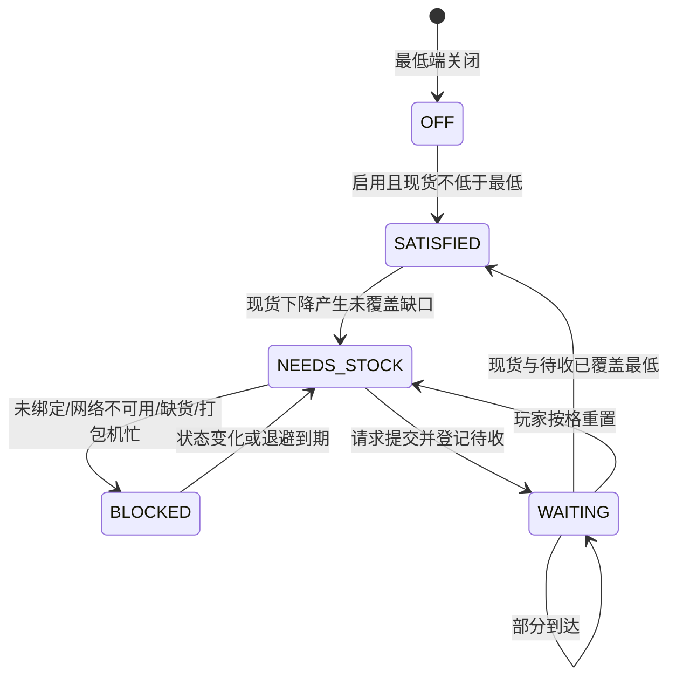
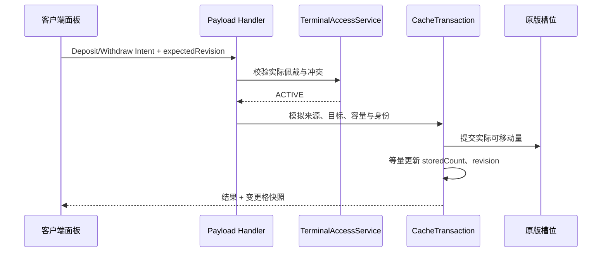

# 架构设计

- **计划版本**：plan-v1.0
- **目标发布**：0.1.0
- **平台基线**：Minecraft 1.21.1、NeoForge 21.1.219、Create 6.0.10、Curios 9.5.1+1.21.1
- **产品权威**：[项目计划书](../项目计划书.md)
- **技术证据**：[首版技术栈核查](../research/2026-08-29-首版技术栈核查.md)

> **2026-09-05 架构暂停：** 下方“玩家附件保存唯一缓存”和 schema 1→2 迁移架构只描述 `test.12` 以前的实现。新模型须分别表达随普通坠子的本件缓存与随玩家的个人缓存，使用 1—5 级及通用插件舱，并直接采用干净 schema；不增加旧测试格式兼容或迁移模块。完成重写与实施授权前，不得据旧架构继续编码。

## 1. 架构结论

旧 `test.12` 采用“玩家附件保存唯一个人缓存、物品数据组件保存终端绑定”的结构；该所有权部分已经失效。真实包裹、服务端事务、精确组件身份以及纸飞机／运输蜂沿用原生派送的边界仍可作为新架构输入。新架构结论须在本件缓存、个人缓存、缓存令牌、1—5 级、插件舱和收件口研究完成后重写。

有两道不同的启用门：

1. **本地访问门**：至少佩戴一件已启用供应链坠，且已启用坠子之间没有不同网络冲突。通过后可看缓存、存取、合成取料、弓弩取料和接收迟到包；全部坠子未绑定也不影响本地访问。
2. **新请求门**：在本地访问门之上，已启用坠子必须归并出恰好一个随饰品携带的有效网络绑定，该 Create 网络仍可用且接受请求。只有通过后才发新补货请求；不探测外部配送模组、定位器、成员或路线。

这一区分保证“未绑定时还能用自己的库存”和“不能向无效网络发单”同时成立。

## 2. 分层与模块

```text
dev.scathiard.feedmepackages
├─ FeedMePackages                 模组入口，只做注册与代理装配
├─ registry                       物品、数据组件、附件、菜单、payload 注册
├─ domain                         不依赖客户端和可选模组的规则模型
│  ├─ cache                       格子、阶段、阈值、过滤、修订号
│  ├─ terminal                    终端配置与佩戴状态归并
│  ├─ logistics                   缺口、待收、地址和状态
│  └─ transaction                 模拟、提交、守恒与错误码
├─ storage                        玩家附件 Codec、加载校验、死亡复制
├─ terminal                       Curios 查询、绑定、解绑、逐件禁用
├─ inventory                      缓存存取、目标槽适配、物品身份校验
├─ logistics                      Create 查询／请求、调度、包裹接收
├─ crafting                       原版 2×2／3×3 统一配方转移服务
├─ consumption                    通用耗材来源选择、提交与协议适配
│  └─ projectile                  标准投射物查询／消费适配
├─ network                        C2S 意图、S2C 快照／增量、限流
├─ client                         背包左侧面板、弹窗、状态与输入
└─ compat
   └─ jei                         ghost ingredient 与 recipe transfer
```

核心、领域和公共网络负载的类型签名不得出现三个可选模组的类。兼容模块由各自存在性检查后的代理初始化；缺失模块不参与类加载。

首版目录模型只要求 JEI 兼容模块，不预建纸飞机／运输蜂模块；后续退货确实需要从玩家处发运时再定义对应接口。

## 3. 运行组件

| 组件 | 所在逻辑侧 | 职责 | 不负责 |
| --- | --- | --- | --- |
| `PlayerCacheService` | 服务端 | 读取与提交玩家缓存事务、校验不变量、生成快照 | 运输、GUI 布局 |
| `TerminalAccessService` | 服务端 | 枚举 Curios 坠子、归并绑定、判断本地访问／请求门 | 保存个人物资 |
| `CreateRequestGateway` | 服务端 | 按当前 `ItemVariantKey` 精确查询同物同组件库存、构造保留完整组件的 Create 请求、解释返回与失败 | 按裸 item ID 合并变体或追踪包裹位置 |
| `RestockCoordinator` | 服务端 | 先残包后缺口、扣除待收覆盖、退避与发单去重 | 自建物流网络 |
| `LocalPackageReceiver` | 服务端 | 有界扫描主物品栏、校验专用地址、部分入库、更新残包 | 接管普通包和散装物 |
| `CraftTransferService` | 服务端 | 把背包与缓存中的真实材料事务性放入 2×2／3×3 网格 | 自己生成合成结果 |
| `ProjectileSourceService` | 服务端 | 在弓释放／弩装填的真实提交点选择来源并扣一次 | 改写射击、附魔或弹道 |
| `CachePanelController` | 客户端 | 渲染快照、翻页／滚动、把交互转成意图 | 决定库存数量 |

## 4. 核心数据模型

### 4.1 玩家附件 `PlayerCacheRecord`

玩家附件是个人数据的唯一权威，使用 NeoForge 可序列化 Data Attachment，并开启 `copyOnDeath`。

```text
PlayerCacheRecord
  schemaVersion: int = 2
  playerId: UUID
  tier: Tier = STONE
  sourcePriority: INVENTORY_FIRST | CACHE_FIRST
  slots: CacheSlotRecord[当前阶段格数]
  pendingInbound: PendingInboundRecord[]
  packageJournal: PackageJournalEntry[]
  revision: long
```

`slots` 只保存已解锁格；升级在末尾追加空格。数量字段使用 `long`，即使 0.1.0 的单格上限只有 2,048，也不因后续容量扩展改变存档类型。

```text
CacheSlotRecord
  index: int
  filter: ItemVariantKey?
  storedCount: long
  minimumEnabled: boolean
  minimum: long
  maximumEnabled: boolean
  maximum: long
  filterRevision: long
```

`ItemVariantKey` 是不可变值对象，表达物品注册 ID 与完整持久化组件；数量固定规范化为 1，向外生成 `ItemStack` 时返回防御性副本。模板以注册表感知的 Minecraft 物品栈 Codec 持久化，相等语义为同物同完整组件。摘要只作日志与快速比较，不能替代最终完整比较。

```text
ItemVariantKey
  itemId: ResourceLocation
  components: complete persistent component snapshot
  encodedBytes: <= 1024
```

同一精确变体全玩家缓存唯一；同 ID 不同组件可分别占格。真实背包来源由服务端读取，JEI ghost 可提交有界模板但不生成实物。组件往返不一致、空气、包裹外壳或编码超过 1,024 字节时，在改变来源前拒绝。

```text
PendingInboundRecord
  requestId: UUID
  itemKey: ItemVariantKey
  remainingCount: long
  sourceNetworkId: UUID
  originSlotIndex: int
  filterRevision: long
  submittedGameTime: long
```

待收是防重复请求的本地承诺，不是现货，不证明载具存在。每精确变体最多 4 条、每玩家最多 144 条；新承诺优先合并同 `itemKey`、同网络、同过滤版本的最新记录。归零、按格重置或清除空格过滤后删除活动记录，不保存诊断历史，也不影响真实包裹。

### 4.2 供应链坠数据组件 `TerminalConfig`

```text
TerminalConfig
  schemaVersion: int = 1
  terminalId: UUID
  networkId: UUID?
  disabled: boolean = false
  revision: long
```

该组件持久化并网络同步。`terminalId` 只用于定位佩戴槽和诊断，不是个人缓存主键，也不授予网络权限。服务端发现同一玩家佩戴两个相同 `terminalId` 时，按稳定排序为较后的复制品重新生成 ID 并把本件修订加 1；网络绑定与禁用值保留。

### 4.3 包裹收据数据组件 `PackageReceipt`

本模组只给地址匹配的 Create 包裹写入收据：

```text
PackageReceipt
  receiptId: UUID
  ownerId: UUID
  address: String
  firstSeenGameTime: long
  arrivalCounts: Map<ItemVariantKey, long>
  allocatedCounts: Map<ItemVariantKey, long>
```

收据确保同一包裹由插入通知、物品栏变化和周期扫描多次发现时，只进行一次“到达待收结算”。后续从残包继续转移真实内容仍允许发生，但不重复抵扣待收。收据所有者与当前玩家不一致时不自动处理。

### 4.4 物资事务日志

缓存附件和原版玩家物品栏都随同一玩家数据保存。`SPK-DATA-01` 必须证明二者处于同一保存快照；通过前保留 `packageJournal`：

```text
PackageJournalEntry
  operationId: UUID
  receiptId: UUID
  movedToCache: Map<ItemVariantKey, long>
  settledInbound: Map<ItemVariantKey, long>
  packageBeforeDigest: bytes
  packageAfterDigest: bytes
  playerBeforeDigest: bytes
  playerAfterDigest: bytes
  phase: PREPARED | COMMITTED
```

包裹事务在单个服务端主线程调用内完成“验证 → 记录 PREPARED → 改包裹与收据 → 改缓存及待收 → 校验守恒 → 标 COMMITTED”。一个包裹的一次处理只写一条日志，其中两个 map 覆盖最多 9 个内容槽涉及的全部物品。每玩家最多 256 条或 256 KiB 活动日志；`COMMITTED` 经下一次成功保存后清理，达到上限时背压新收包而不删数据。加载时遇到非终态条目即封锁该玩家的自动收包并输出诊断，绝不猜测一侧已经保存。该封锁只是异常保护，不是可接受的物资损失恢复：四个正常故障注入切点重载后，包裹实物加缓存现货必须与提交前总量相同；做不到就阻塞 M3。若 Spike 证明同一玩家文件保存具备所需原子性，日志仍保留为诊断，不参与普通路径回滚。

### 4.5 schema 1 → 2 解码迁移

玩家附件 Codec 显式分派两个版本：

1. schema 2 直接解码完整 `ItemVariantKey`。
2. schema 1 先按旧结构完整解码，再使用当前服务端注册表把过滤、待收和日志中的每个 `itemId` 转成该物品的默认精确变体；格位、数量、阈值、修订、请求 ID、网络和日志摘要逐值保留。
3. 迁移模型通过全部 schema 2 不变量后才进入运行态；下一次成功保存写 schema 2。重复加载同一 schema 1 输入必须得到相同结果。
4. 旧 ID 缺失、默认模板不能安全编码或迁移后冲突时，保留原始玩家数据并进入 `BLOCKED_CORRUPT`；不得跳过字段、清空附件或创建第二份数据。

迁移实现与夹具以[决策 0001](../decisions/0001-精确组件物品身份.md)和规格 01 的 `SPK-DATA-03` 为准。该授权不允许删除玩家文件。

## 5. 状态模型

### 5.1 佩戴归并

对 Curios 中全部供应链坠按槽位稳定排序；先保留总佩戴数，再忽略 `disabled=true` 的坠子计算有效集合：

| 条件 | 本地状态 | 新请求状态 |
| --- | --- | --- |
| Curios 中没有供应链坠 | `INACTIVE` | `BLOCKED_NOT_WORN` |
| 有佩戴坠子但没有已启用坠子 | `MANAGEMENT_ONLY` | `BLOCKED_DISABLED` |
| 已启用坠子的非空网络集合大小为 0 | `ACTIVE` | `BLOCKED_UNBOUND` |
| 非空网络集合大小为 1 | `ACTIVE` | 继续校验 Create 网络与请求受理 |
| 非空网络集合大小大于 1 | `MANAGEMENT_ONLY` | `BLOCKED_CONFLICT` |

同网多件不叠加格数、容量、扫描频率或发单次数。冲突管理态只允许读取终端列表和提交逐件禁用／清绑；全部禁用管理态允许读取列表并逐件启用／清绑。两种管理态都拒绝旧缓存菜单的其他意图；只有完全未佩戴时不提供任何本模组入口。

### 5.2 补货格状态



状态图不含超时转移。绿色下箭头表示 `remainingInbound > 0`；灰色下箭头表示存在未覆盖缺口且当前无法提交。它们不宣称载具坐标。

## 6. 服务端事务协议

所有能改变真实物资或配置的入口统一执行：

1. 从连接上下文取得实际 `ServerPlayer`，拒绝客户端提供玩家 UUID。
2. 重新枚举 Curios 并校验当前操作所需的本地访问门或请求门。
3. 以服务端菜单槽位和附件为准，比较客户端提交的 `expectedRevision`。
4. 完整模拟来源提取、目标接收、过滤、容量、原生堆叠与余物位置。
5. 模拟结果为 0 或任一前置条件失败时，返回稳定错误码且不提交局部变化。
6. 在服务端主线程提交等量移动或一次配置变化。
7. 校验不变量，修订号加 1，标记玩家数据变化并发送最小增量快照。
8. 由事件队列触发后处理；后处理失败不逆转已完成的玩家手动操作，也不能补偿生成物资。

客户端重发旧修订号只会得到 `STALE_REVISION` 和新快照。模拟、悬停、配方预览、拉弓查询、状态轮询都不能进入提交步骤。

## 7. 主要数据流

### 7.1 存入与取出



缓存减少后只把该物品加入补货脏集合；同一 tick 的多次变化在 tick 末合并评估。

### 7.2 补货

```text
缓存变化／阈值变化／重新佩戴
  → 本地访问门
  → 扫描并续收现有专用残包
  → N、L、P 重新取值
  → R = max(0, L - N - P)
  → 请求门
  → Create 准确库存 A
  → Q = min(R, A)
  → 先持久化请求承诺 PendingInboundRecord
  → 调用一次 Create 请求派发(FMP@玩家名, Q)
  → 调用开始后的异常保留待收，不自动重发
```

本图的请求承诺顺序以规格 04 为准：外部调用可能部分成功，不能等返回后才记账。纸飞机和运输蜂沿原生设施自行运输，FMP 不登记目标或截取产包；二者共存不会各调用一次 Create 请求。

### 7.3 本地收包

每个有效本地访问玩家维护由版本钉住的玩家主物品栏变更 hook 驱动的 `inventoryDirty`；正确性另有 20 tick 兜底扫描，不依赖 hook 永不漏报。服务端玩家 tick 中：

- hook 把 `inventoryDirty` 置真时，最迟下一服务端 tick 扫描 36 个主物品栏／快捷栏槽；
- 即使计数不变，也每 20 tick 做一次兜底扫描；
- 只对 `PackageItem.isPackage` 且地址精确等于当前 `FMP@玩家名` 的栈进入事务；
- 扫描顺序固定为槽号升序，包内顺序固定为 0—8，缓存格按索引定位；
- 当前没有本地访问时完全不扫描和改包。

第一次观察时先完整验证包，再把每个合法内容栈规范化为 `ItemVariantKey` 并写收据；只抵扣当时仍存在的同精确变体过滤及其当前修订下的待收。随后把可接受的精确变体移入对应格。容量不足、无匹配过滤、模板超限或无法安全解码的余物留在原包，完整组件不变；包内容全部安全清空后才移除包壳。

### 7.4 合成配方转移

原版配方书和 JEI 共用 `CraftTransferService`：

1. 服务端取得所选配方和目标菜单，不接受客户端提供的结果物品。
2. 按原版匹配规则确定每个网格槽的候选材料。
3. 当前网格中已在正确位置且符合配方候选的材料优先保留；仍缺的材料按玩家的背包优先／缓存优先选择，首选不足再用另一来源。
4. 模拟把旧网格内容退回普通背包，并模拟把新材料放入真实 2×2／3×3 网格；任何物品无位置时整体拒绝。
5. 一次提交普通背包移动和缓存扣减。此时材料已经离开缓存，关闭界面后按原版返回普通背包，不自动塞回缓存。
6. 合成结果、批量消费和桶等余物继续由原版菜单处理。

普通点击与“最大填充”沿用入口原有语义，最大数量仍受每个网格槽原生堆叠上限限制。

### 7.5 标准投射物耗材

`AuxiliaryItemConsumptionService` 统一处理消费者栈、候选谓词、来源顺序、查询／提交、防重与缓存扣减；标准投射物由 `ProjectileAmmoAdapter` 接入。手上明确持有的合法投射物保持原版最高优先级。手中没有时，适配器按玩家开关在普通背包和缓存之间选择：普通背包保持原版槽位顺序，缓存按格索引升序。实现不检查物品是否为弓或弩 ID；沿用 `LivingEntity#getProjectile` 与 `ProjectileWeaponItem.draw/useAmmo` 的消费者使用同一路径。

- 弓只在服务端确认释放会生成投射物时提交缓存扣减；取消拉弓和查询不扣。
- 无限或创造模式按原版决定消费为 0，本模组不额外扣。
- 弩在成功把投射物写入武器装填数据时扣一次，发射已装填弩不再扣。
- 多重射击按原版只消费一份装填材料。
- 缓存中的精确组件弹药按武器谓词参与候选；选择、装填与投射物生成必须保留完整组件，同 ID 异组件不合并。
- 非原版测试子类必须在不登记物品 ID 的情况下通过；绕开标准链的物品保持原行为，待独立适配器接入。

具体注入点由 `SPK-AMMO-01` 固定；不得全局拦截 `ItemStack.shrink/split/consume`，也不得用“先取到背包再等玩家操作”替代，因为前者缺少消费语义，后者会在取消操作时提前扣缓存。

## 8. 客户端同步与安全

客户端快照只包含当前玩家已解锁格、展示模板、数量、阈值、待收汇总、阶段、来源偏好、访问状态、终端列表和修订号。网络 UUID 只在终端管理界面以缩短形式显示；复制完整地址不等于复制网络 UUID。

C2S 负载按玩家每 tick 合并相同滑条意图，并设置每玩家速率上限。服务端拒绝：

- 越界格号、超容量阈值、交叉端点；
- 不属于当前菜单的来源／目标槽；
- 客户端构造的实物或玩家身份；JEI ghost 只可提交不超过 1,024 字节且能完整往返的模板，不能作为实物来源；
- 未佩戴、冲突、旧修订号和已经改变的过滤；
- 不在交互距离内的绑定目标或无权修改的方块；
- 超过模板 1,024 字节、C2S 8 KiB、S2C 快照 64 KiB、列表长度或字符串长度限制的数据。

服务端日志记录操作类型、玩家 UUID、终端 ID、格号、物品 ID、组件身份短摘要、数量、网络短 ID、结果码和异常；不记录完整玩家聊天、完整组件／NBT 或包裹内敏感第三方数据。摘要不参与库存权威判断。

## 9. 网络绑定流程

首版的绑定入口固定为：玩家手持供应链坠，对已加载的 Create Stock Link 潜行右击。服务端校验交互距离、方块仍存在、玩家拥有普通方块交互权限，并从该方块实际物流行为读取网络 UUID；客户端不能直接提交 UUID。成功后只改手中坠子的 `TerminalConfig`。

已装备坠子可在冲突／设置面板中执行：

- 禁用或启用本件；
- 清除本件绑定；
- 复制本模组收货地址 `FMP@当前玩家名`。

清除绑定不清缓存或待收。Create 6.0.10 没有供本模组复用的通用玩家 ACL 时，“合法绑定后由当前实际佩戴的饰品持有其 UUID”就是可转交的核心 Create 网络能力；发单仍须确认网络可用且请求入口接受。运输蜂的网络成员检查继续由 Mobile Packages 原生逻辑按当前玩家执行，FMP 不新增补货适配层。后续目标 Create 版本若提供 ACL，须先形成新的产品与存档兼容决策，不能在首版实现中暗加不可见的原持有者锁。

## 10. 计划中的源码与资源目录

工程获准后建立：

```text
src/main/java/dev/scathiard/feedmepackages/...
src/main/resources/
├─ META-INF/neoforge.mods.toml
├─ assets/create_feed_me_packages/
│  ├─ lang/zh_cn.json
│  ├─ lang/en_us.json
│  ├─ models/item/
│  ├─ textures/gui/
│  └─ textures/item/
└─ data/
   ├─ create_feed_me_packages/
   │  ├─ recipe/
   │  ├─ tags/
   │  └─ curios/entities/player.json
   └─ curios/tags/item/necklace.json
src/test/java/dev/scathiard/feedmepackages/...
src/gametest/java/dev/scathiard/feedmepackages/...
src/gametest/resources/data/create_feed_me_packages/structure/...
```

资源必须原创。生成的测试实例放 `run/`，发布物放版本化 `release/v0.1.0/`；二者不与玩家真实存档混用。

## 11. 技术风险与固定防线

| 风险 | 防线 | 发布门 |
| --- | --- | --- |
| Create 请求返回值不能证明实际出包，或库存查询混合同 ID 组件变体 | 请求前按完整 `ItemVariantKey` 精确查库存、请求原样保留组件、按承诺记账、手动重置、无法区分时禁止该变体发单 | `SPK-CREATE-01` 与缺货／变体／竞态 GameTest |
| 组件模板过大、可变键或编解码后身份改变 | 不可变键、防御性副本、1,024 字节模板上限、往返相等校验、快照 64 KiB 门 | `SPK-DATA-02`、协议载荷测试、36 格满载测试 |
| schema 1 迁移丢字段或重复结算旧包 | 双版本解码、逐字段默认变体转换、失败封锁、跨 JVM 固定夹具 | `SPK-DATA-03` 与迟到包／日志回归 |
| 玩家附件与包裹保存切点造成复制或损失 | 同一主线程事务、收据、事务日志、加载封锁 | `SPK-DATA-01`、崩溃点故障注入 |
| 可选模组缺失导致类加载崩溃 | 兼容包隔离、条件初始化、公共签名无可选类型 | 六组合启动矩阵 |
| 纸飞机预拆成散装 | 只声明并测试完整包模式；散装保持原版 | 纸飞机专测 |
| 蜂成员资格或背包条件被绕过 | 调用原生资格检查，不从地址字符串推导成员关系 | 蜂非成员／满背包专测 |
| UI 与配方书／JEI 重叠 | 可折叠左面板、滚动、缩放矩阵 | `SPK-UI-01` 人工截图矩阵 |
| 合成或弓弩提前扣料 | 统一模拟／提交、只在真实网格转移或消费点扣 | 取消、失败、余物、重复事件测试 |
| Lambda License 污染发布物 | 不复制、不派生、不捆绑，交付前 JAR 内容审计 | `SPK-LIC-01` |

## 12. 架构决策记录入口

实施阶段若改变数据归属、保存载体、请求记账、绑定入口或兼容隔离，先在 `docs/decisions/` 新建决策记录，再改代码与本文件。普通像素调整和配方数值平衡只记入变更记录，不创建架构决策。

本文件定义的是 0.1.0 的实施架构。退货的一次性蜂、运输物格和返回地址在 0.2.0 单独扩展，不提前塞入补货状态机。
